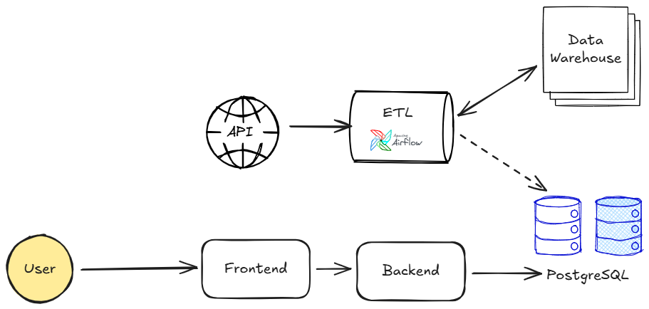

# Widya Analytic: Toba.AI

<b>Role:</b> Full-Stack Engineer 
<b>Duration:</b> 2 years

Toba.AI is Widya Analytic’s flagship product that leverages artificial intelligence for <b>trend recognition</b> and <b>text sentiment analysis</b>. The system implements a robust ETL pipeline using Apache Airflow to crawl external data sources, load data into a centralized data lake, and transform it into structured formats for downstream analysis.

<b>Tech Stack</b>

- <b>Frontend:</b> Vue.js
- <b>Backend:</b> Django REST Framework
- <b>Databases:</b> PostgreSQL

### Contributions

- <b>Insight API Development:</b> Engineered backend APIs to deliver analytical insights from Instagram account data, powering visualizations and metrics across the <b>"Audiens," "Kompetitor,"</b> and <b>"Performa"</b> tabs.
- <b>Analytical Data Aggregation:</b> Built complex query logic to perform multi-dimensional aggregation (data cube), including time-series breakdowns, sentiment tracking, and statistical number.
- <b>Scalable Data Architecture:</b> Ensured high-performance delivery of insights by optimizing query structures and schema designs within PostgreSQL to handle large-scale analytical workloads.

### Capabilities Demonstrated

- Skilled in designing and developing <b>RESTful APIs that serve complex analytical data</b>, enabling insight-driven user experiences through visual dashboards and metrics.
- Experienced in crafting <b>complex SQL queries</b> to perform multi-dimensional data aggregation (data cube), including time-series analysis and sentiment scoring.

### Architecture

<figure style="width:100%">
    
    <figcaption style="text-align:center"><small>Figure 1. Widya Analytic Toba.AI - Architecture</small></figcaption>
</figure>

### Documentation

<figure style="width:100%">
    
    <figcaption style="text-align:center"><small>Capture 1. Toba.AI V0</small></figcaption>
</figure>

  

    <figure style="width:100%">
        
        <figcaption style="text-align:center"><small>Capture 2. Toba.AI V1 - Brand List</small></figcaption>
    </figure>
  

  

    <figure style="width:100%">
        
        <figcaption style="text-align:center"><small>Capture 3. Toba.AI V1 - Brand Detail</small></figcaption>
    </figure>
  

  

    <figure style="width:100%">
        
        <figcaption style="text-align:center"><small>Capture 4. Toba.AI V2 - Audiens</small></figcaption>
    </figure>
  

  

    <figure style="width:100%">
        
        <figcaption style="text-align:center"><small>Capture 5. Toba.AI V2 - Kompetitor</small></figcaption>
    </figure>
  

  

    <figure style="width:100%">
        
        <figcaption style="text-align:center"><small>Capture 6. Toba.AI V2 - Performa</small></figcaption>
    </figure>
  

