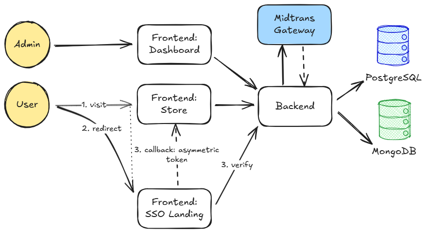

# Widya Analytic: Store Platform

<b>Role:</b> Full-Stack Engineer 
<b>Duration:</b> 8 months

A comprehensive web platform that hosts the <b>Widya Analytic product store</b>, blog access— integrated with WordPress CMS, and event registration. The platform supports seamless purchases transactions, and Single Sign-On (SSO) for user authentication across all Widya Analytic products.

<b>Tech Stack</b>

- <b>Frontend:</b> Vue.js
- <b>Backend:</b> Django REST Framework
- <b>Databases:</b> PostgreSQL, MongoDB
- <b>Third-Party Integrations:</b> Midtrans (Online Payment Gateway)

### Contributions

- Developed a <b>product store API</b> with integrated <b>online payment</b> using <https://midtrans.com/id>, enabling seamless transactions for digital products.
- Built an <b>SSO (Single Sign-On) authentication system</b> to unify user sessions across all Widya Analytic platforms, improving user experience and access control.
- Implemented an <b>Event Management API</b> using <b>MongoDB</b> to handle dynamic, unstructured event-related data with high flexibility.
- Contributed an <b>internal ReactJS dashboard</b> (another platform) for monitoring and managing all product payment transactions, providing key insights and operational oversight.

### Capabilities Demonstrated

- Full-stack development across <b>multiple frameworks and technologies</b> (Vue, React, Django, PostgreSQL, MongoDB).
- Experience integrating secure <b>third-party payment systems</b>.
- Designed cross-platform <b>SSO architecture</b>e to centralize authentication flows.

### Architecture

<figure style="width:100%">
    
    <figcaption style="text-align:center"><small>Figure 1. Widya Analytic Store - Architecture</small></figcaption>
</figure>

### Documentation

<figure style="width:100%">
    
    <figcaption style="text-align:center"><small>Capture 1. Widya Analytic Store - Banner</small></figcaption>
</figure>

[Back](./)
