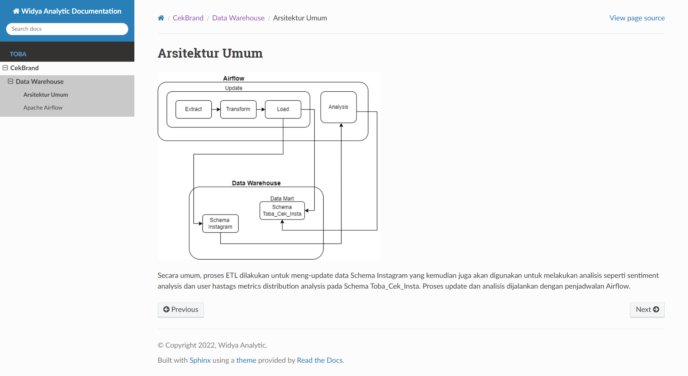
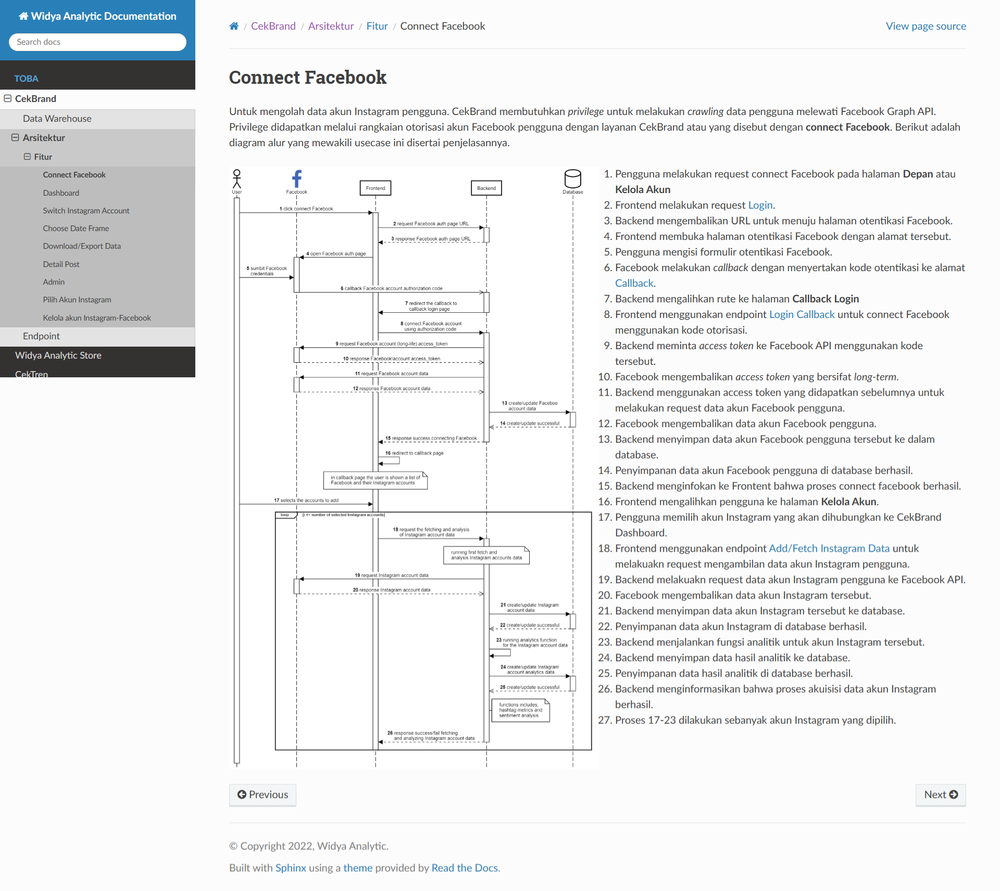

# Widya Analytic: Documentation Platform

<b>Role:</b> Technical Writer 
<b>Duration:</b> 2 months

The Widya Analytic Documentation, serves as a centralized and structured knowledge base for all product and engineering documentation. It consolidates critical information such as <b>High-Level Architecture (HLA)</b> diagrams, <b>API specifications</b>, and <b>service sequence diagrams</b>, ensuring alignment between engineering and product teams. This platform was designed to support clarity, accessibility, and scalability as Widya Analytic's systems evolved.

<b>Tech Stack:</b> Markdown, Sphinx

### Contributions

- <b>Developed and maintained</b> a comprehensive documentation portal with [Sphinx](https://www.sphinx-doc.org/), covering all major system components and development workflows.
- <b>Standardized documentation structure</b> across teams, improving consistency, readability, and ease of navigation.
- <b>Documented High-Level Architectures (HLA), APIs, and service interactions</b>, enabling faster understanding and onboarding for internal stakeholders.
- <b>Improved developer experience</b> by ensuring all technical references were up-to-date, version-controlled, and easily accessible.
- <b>Enhanced visual communication</b> through integrated diagrams that clearly illustrated system flows and dependencies.

### Capabilities Demonstrated

- Proficient in <b>building centralized documentation platforms</b>, consolidating system architecture, API references, and service diagrams to support cross-team alignment and scalability.
- Skilled in <b>visualizing and documenting</b> architecture and service flows, making complex systems more accessible to developers and product teams.
- Experienced in defining and maintaining <b>standardized documentation practices</b>, improving clarity, reducing onboarding time, and ensuring up-to-date technical references.

### Documentation

<figure style="width:100%">
    
    <figcaption style="text-align:center"><small>Capture 1. Documentation - ETL Architecture</small></figcaption>
</figure>

  

    <figure style="width:100%">
        
        <figcaption style="text-align:center"><small>Capture 2. Documentation - Dashboard</small></figcaption>
    </figure>
  

  

    <figure style="width:100%">
        
        <figcaption style="text-align:center"><small>Capture 3. Documentation - Connect Facebook</small></figcaption>
    </figure>
  

<figure style="width:100%">
    
    <figcaption style="text-align:center"><small>Capture 4. Documentation - Endpoint</small></figcaption>
</figure>

[Back](./)
