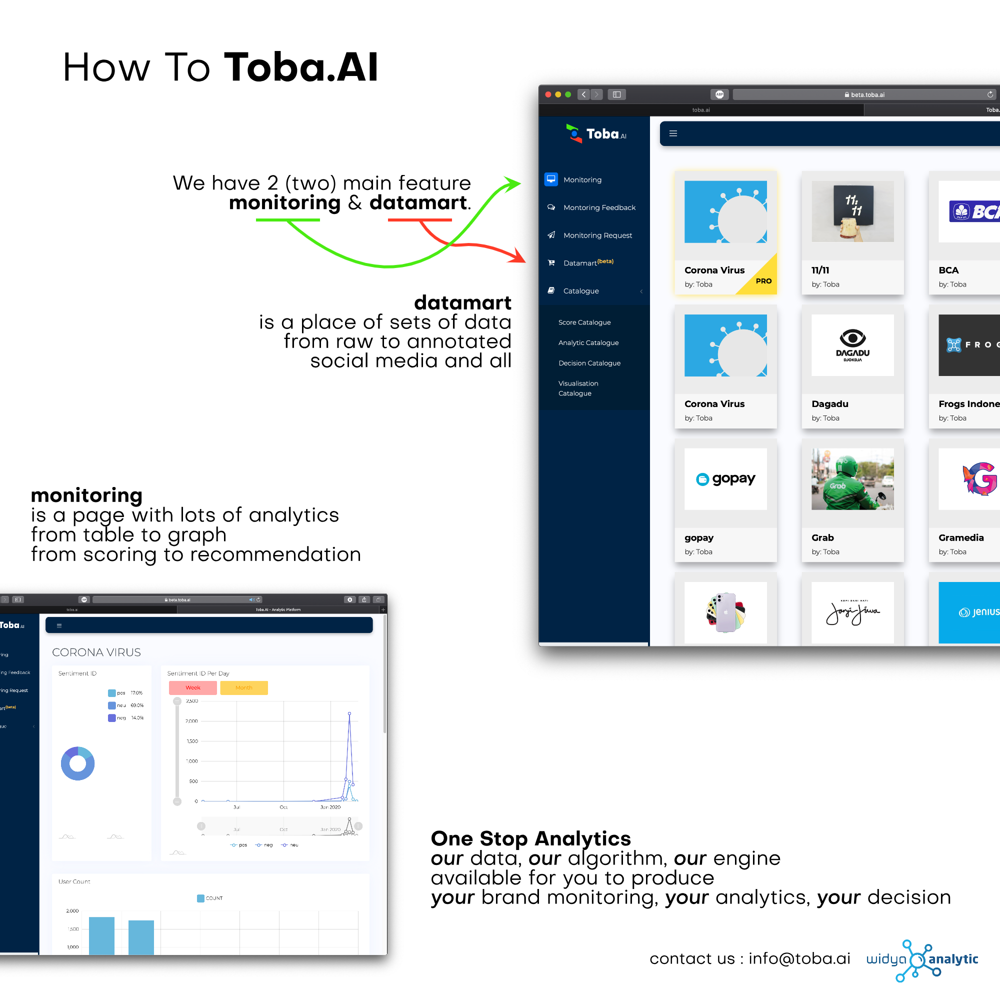
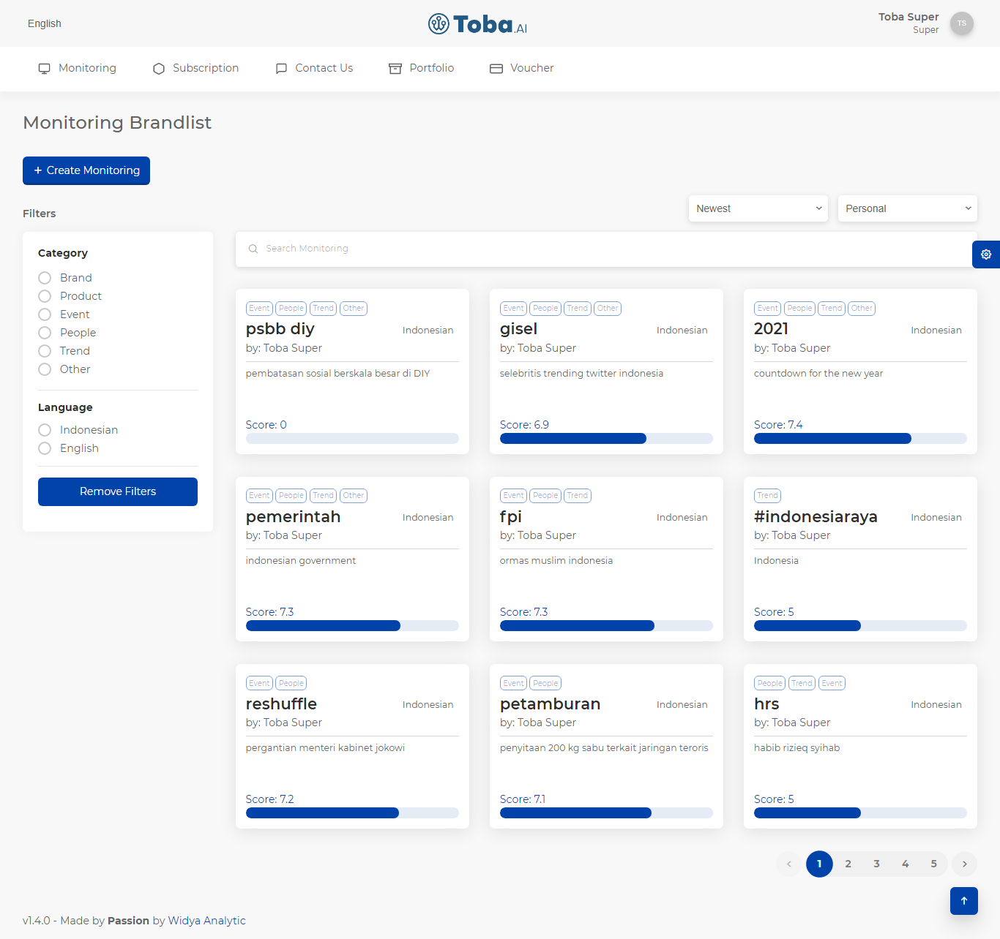
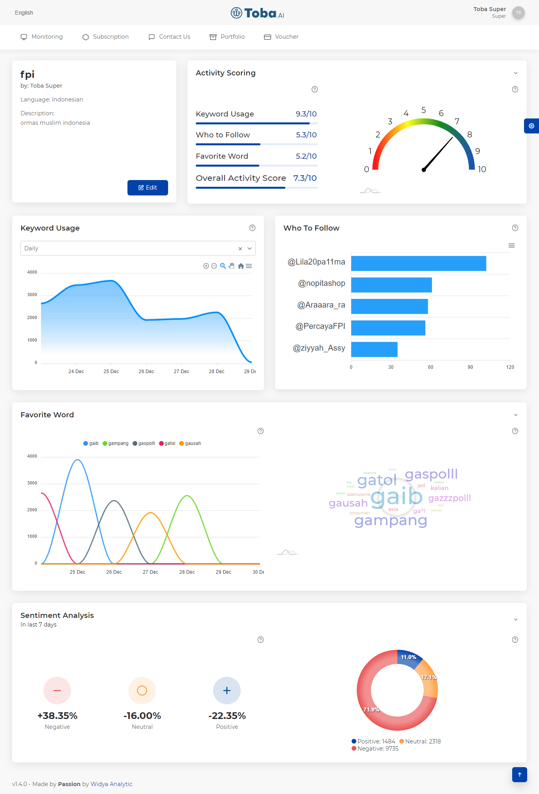
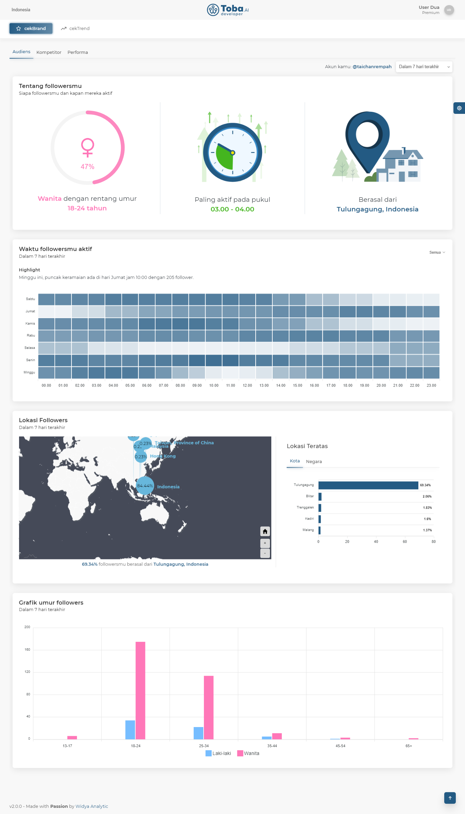
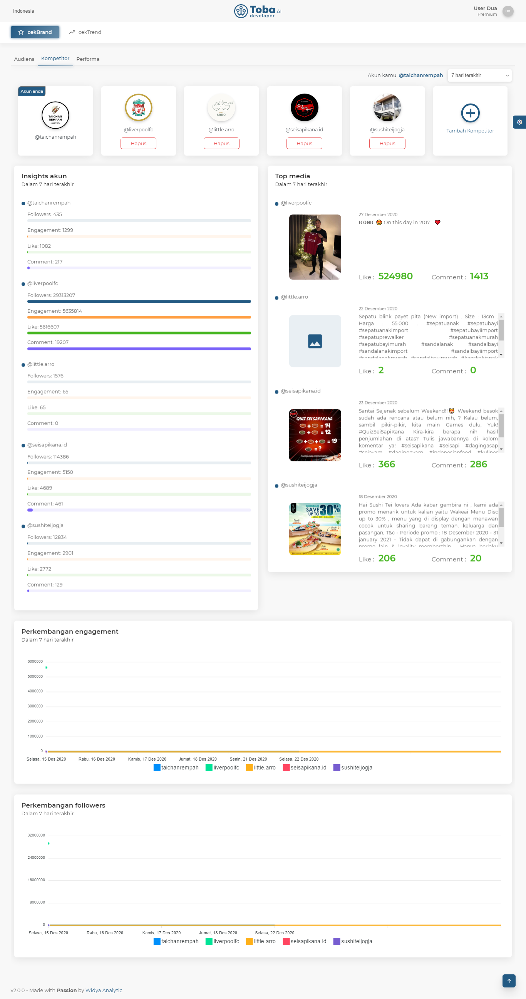
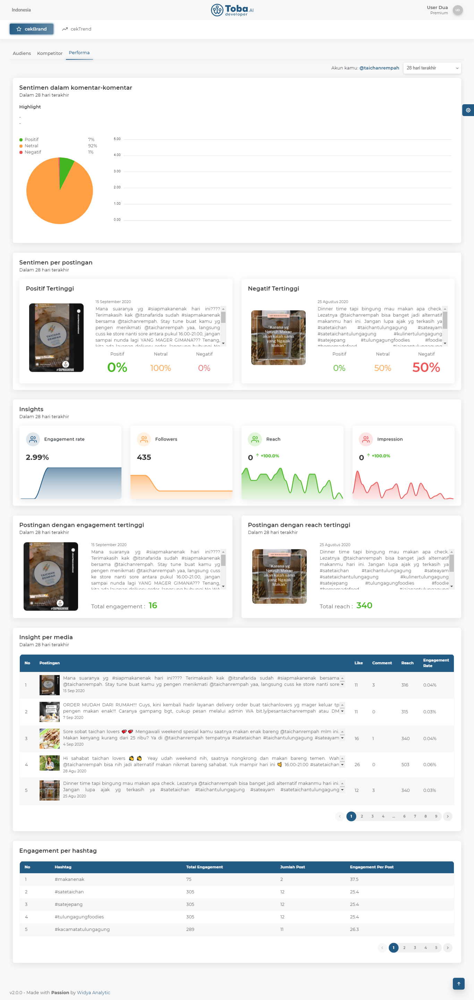

# Widya Analytic: Toba.AI

It is Widya Analytic main baseline product. In general, this app provides artificial intelligence technology primarily for trend recognition and text sentiment analysis. Toba.AI performs an ETL data pipeline using Airflow to crawl data sources from Instagram and Twitter, manage the data lake and transform the data into a structured data table.

I have been developing the API that returns **analytical insight of a social media** (Instagram) account. The data is presented by graph and statistics numbers at the 'Statistik' and 'Top Post' tabs. The API needs complex queries to aggregate the cube of structured analytical data including the time series of account data, sentiment and another account insight.

**Tech Stack:**

- **Language:** Vue.js, Django
- **Database:** PostgreSQL, MongoDB
- **CI/CD & Orchestration:** Jenkins, Docker

### Documentation

{:target="_blank"}

{:target="_blank"}

{:target="_blank"}

{:target="_blank"}

{:target="_blank"}

{:target="_blank"}
