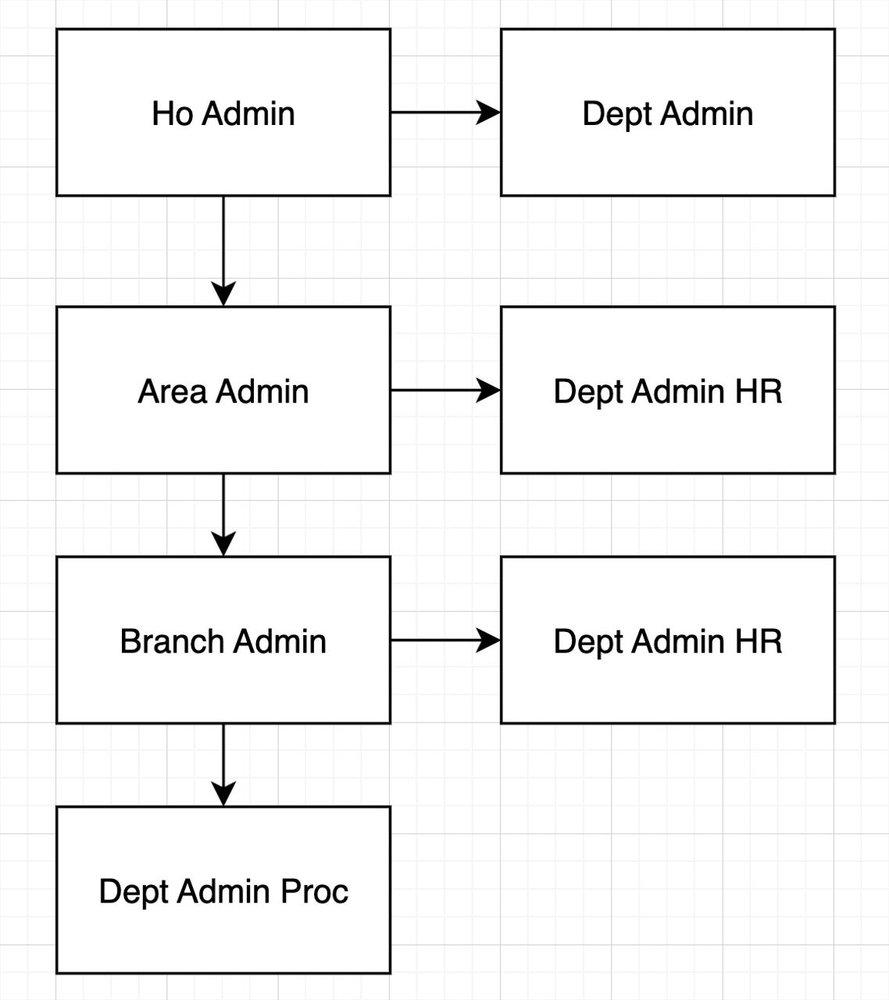
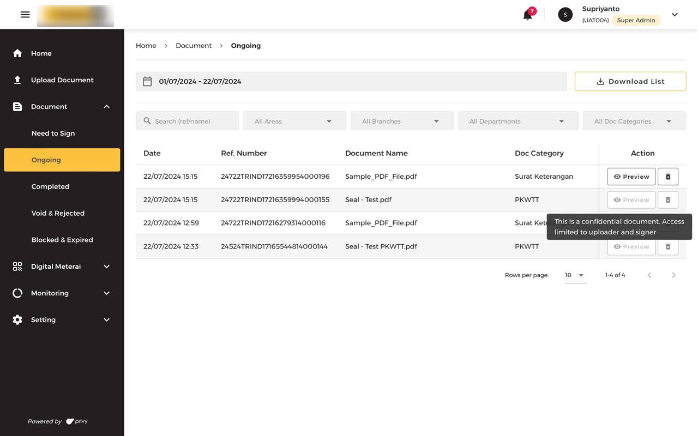
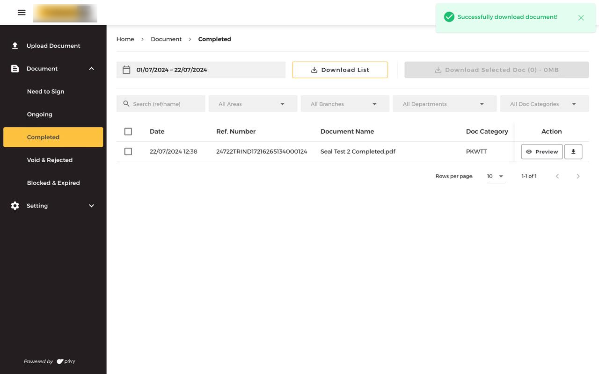
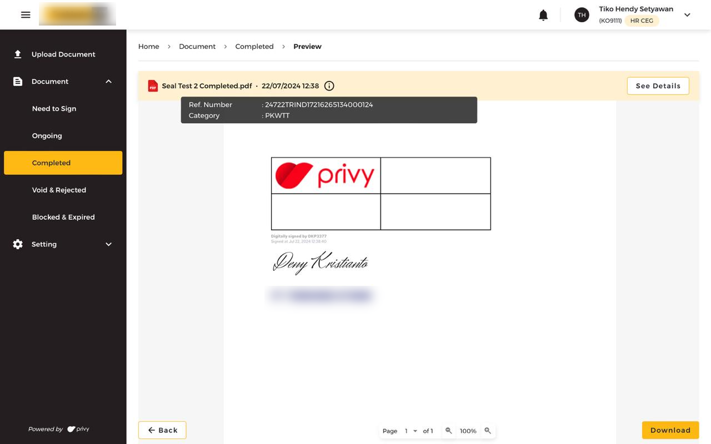
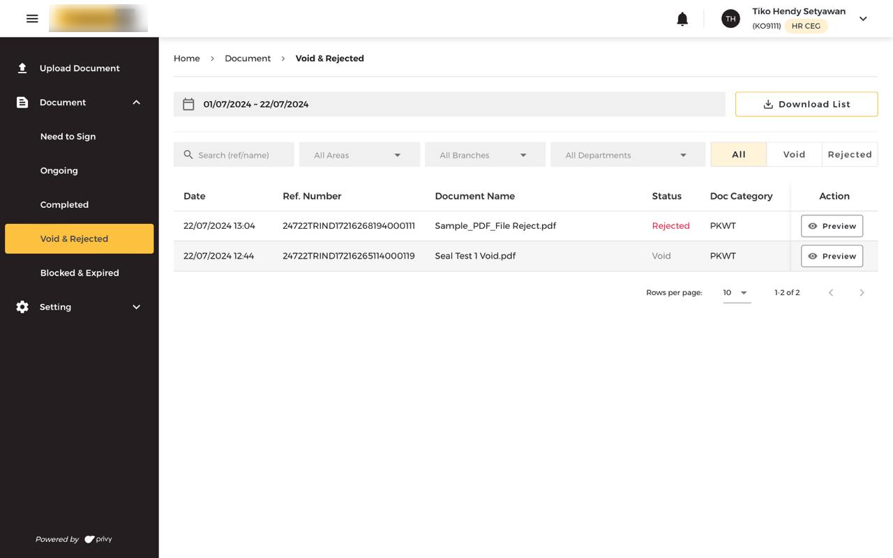
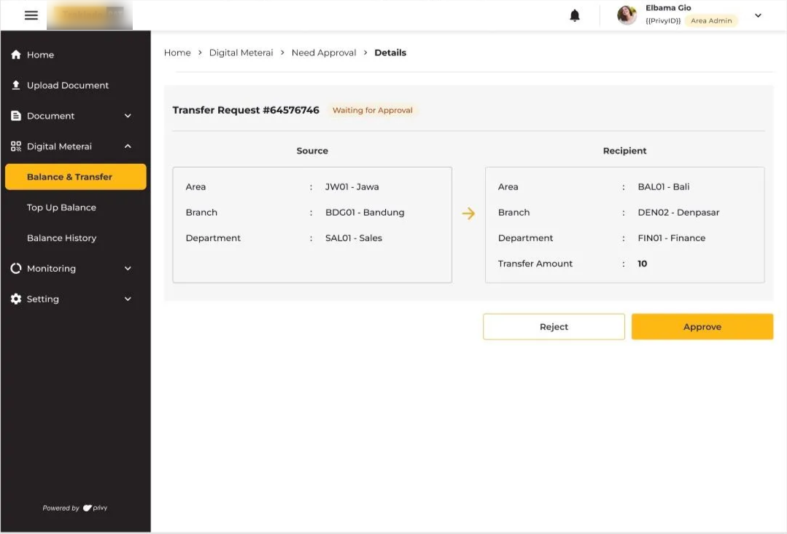
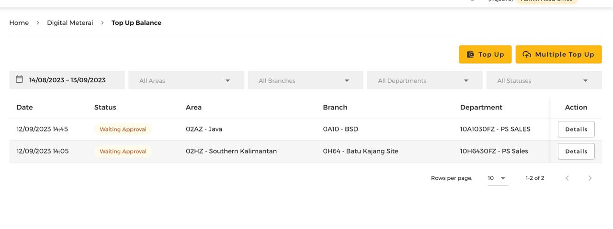
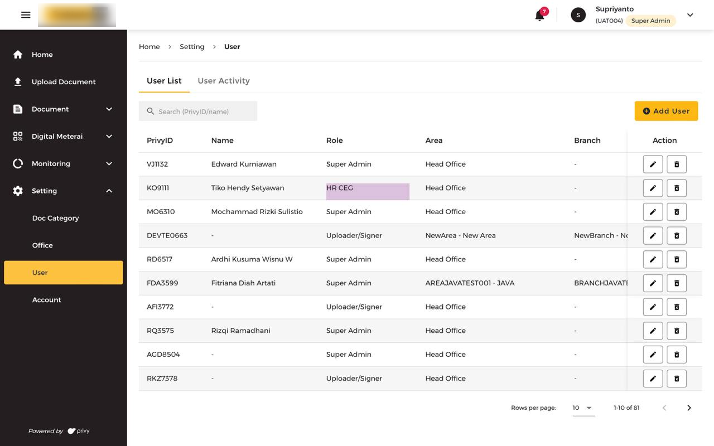
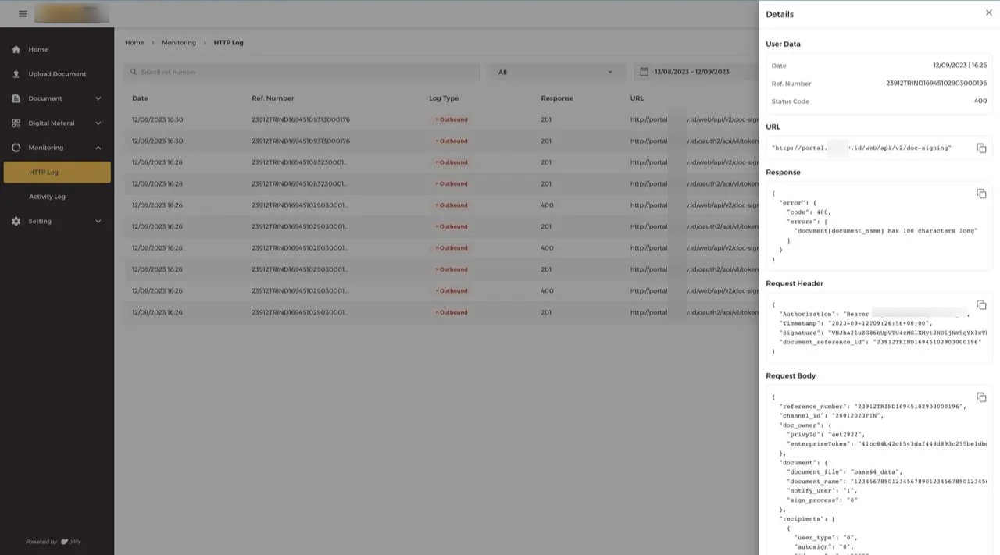

# Privy Customization: Digital Document Center (DDC)

<b>Role:</b> Back-End Engineer 
<b>Duration:</b> 6 months

The Digital Document Center (DDC) is a comprehensive dashboard to s<b>treamline and monitor document lifecycle activities</b>, including upload, distribution (blast), approval, rejection, and electronic signing (both standard and with e-Meterai). This system is seamlessly integrated with Privy Core, allowing secure and compliant <b>digital signature capabilities</b>.

<b>Tech Stack<b>

- <b>Backend Framework:</b> Ruby on Rails (leveraging Grape API for robust API endpoints)
- <b>Database:</b> PostgreSQL
- <b>CI/CD & Orchestration:</b> Jenkins, Docker
- <b>APM:</b> Sentry

### Contributions

- Implemented a feature for signing documents with <b>custom QR codes</b> using the [HexaPDF](https://hexapdf.gettalong.org) library.
- Developed a <b>top-up/transfer balance API</b>, integrated with two internal systems related to invoicing and warehousing (e.g., Portal and Sales).
- Built a <b>user management system</b> with 3-level hierarchical access (Area, Branch, Department), supporting 348 enterprise users and 250 departments.
    <figure style="width:50%">
        
        <figcaption style="text-align:center"><small>Illustration 1. User hierarchy</small></figcaption>
    </figure>

### Capabilities Demonstrated

- Quickly <b>adapted to a legacy codebase</b> written in Ruby, a new programming language at the time.
- Proactively aligned all new features and improvements with the existing code patterns and architecture.
- Proficient in building <b>RESTful APIs using Ruby on Rails</b> and Grape API (micro-framework).
- Experienced in <b>integrating third-party services</b> (e.g., digital signatures with Privy Core).
- Strong understanding of enterprise <b>user management and multi-level permission systems.</b>
- <b>Familiar with CI/CD pipelines</b> and container orchestration using Jenkins and Docker.

### Documentation

<figure style="width:100%">
    
    <figcaption style="text-align:center"><small>Capture 1. Document Ongoing</small></figcaption>
</figure>

<figure style="width:100%">
    
    <figcaption style="text-align:center"><small>Capture 2. Document Completed</small></figcaption>
</figure>

<figure style="width:100%">
    
    <figcaption style="text-align:center"><small>Capture 3. Document Completed Preview</small></figcaption>
</figure>

<figure style="width:100%">
    
    <figcaption style="text-align:center"><small>Capture 4. Document Void & Reject</small></figcaption>
</figure>

  

    <figure style="width:100%">
        
        <figcaption style="text-align:center"><small>Capture 5. Balance Transfer</small></figcaption>
    </figure>
  

  

    <figure style="width:100%">
        
        <figcaption style="text-align:center"><small>Capture 6. Balance Top-Up</small></figcaption>
    </figure>
  

<figure style="width:100%">
    
    <figcaption style="text-align:center"><small>Capture 7. User Setting</small></figcaption>
</figure>

<figure style="width:100%">
    
    <figcaption style="text-align:center"><small>Capture 8. HTTP Logs</small></figcaption>
</figure>

[Back](./)
