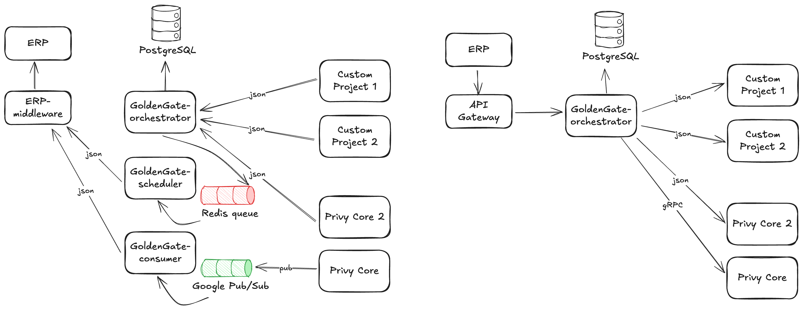

# Privy: ERP - GoldenGate

## Integration Project: ERP - GoldenGate Orchestrator

A backend service responsible for orchestrating transactional data—including top-up, usage, void, and transfer—between internal systems and a third-party ERP platform. The service acts as a orchestrator ensuring data integrity and near real-time event synchronization across business units.

**Tech Stack**

- **Language:** Golang
- **Database:** PostgreSQL
- **Caching & Messaging:** Redis, Google Pub/Sub
- **CI/CD & Containerization:** GitLab CI, Docker

### Capabilities

- Proficient in building scalable, event-driven microservices in Golang using Google Pub/Sub.
- Experienced in integrating external ERP systems with strong data consistency guarantees.

### Challenges

- Ensured high consistency and low-latency performance for transaction-heavy workloads under high traffic.
- Handled shadow balance/subscription logic to maintain transactional accuracy before ERP confirmation.
- Supported seamless data migration while maintaining system integrity and uptime.

### Architecture

{:target="_blank"}

____

Related article: [When Good Systems Go Unadopted: Lessons from Building an ERP Orchestration Layer— Medium](https://medium.com/@ymanshur/when-good-systems-go-unadopted-lessons-from-building-an-erp-orchestration-layer-2695c238daf4)
