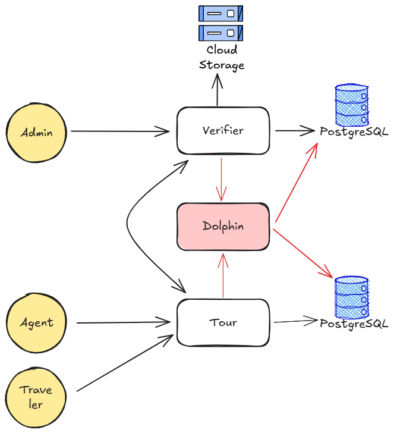
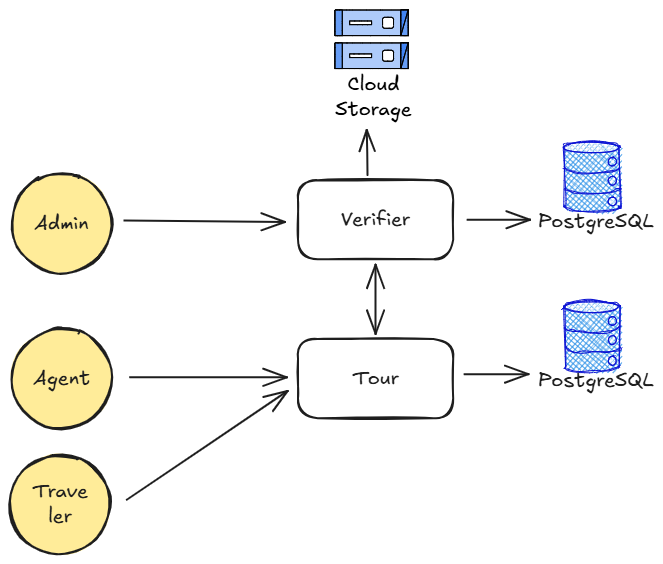
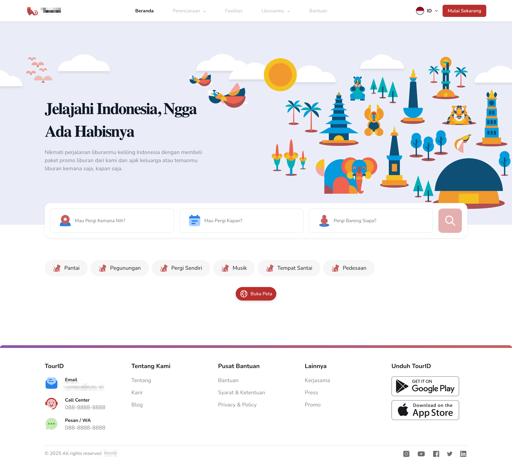
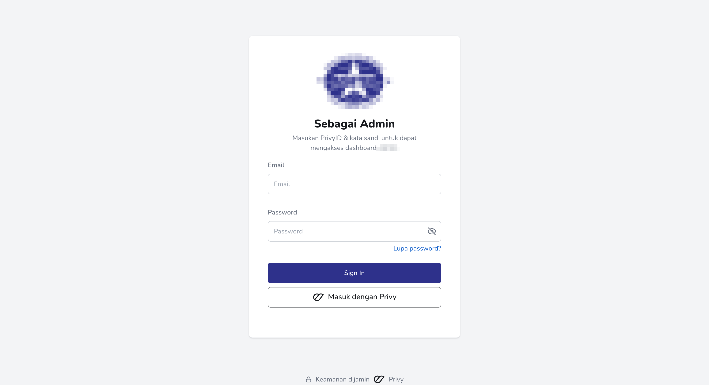
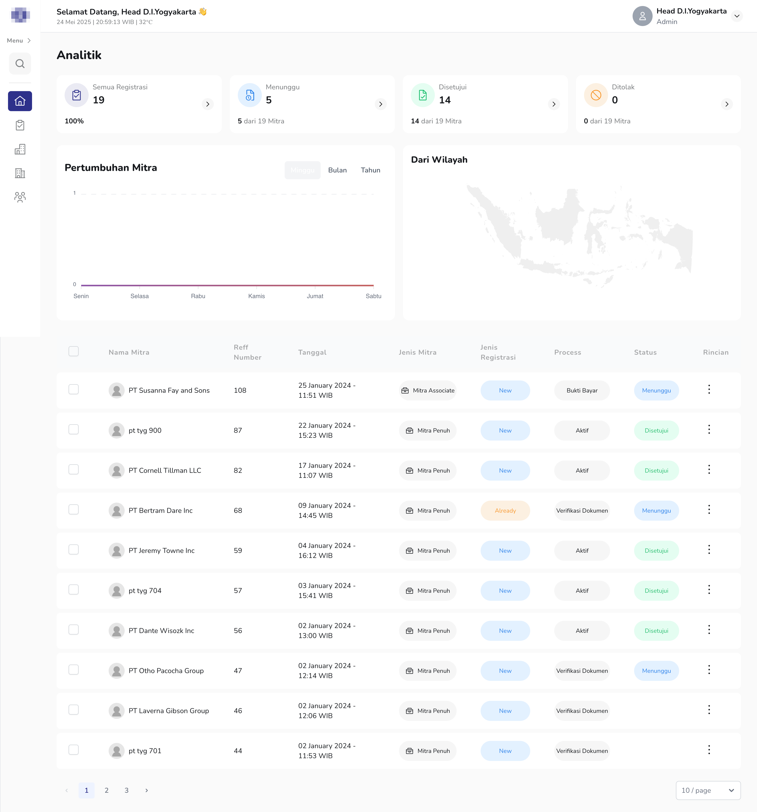
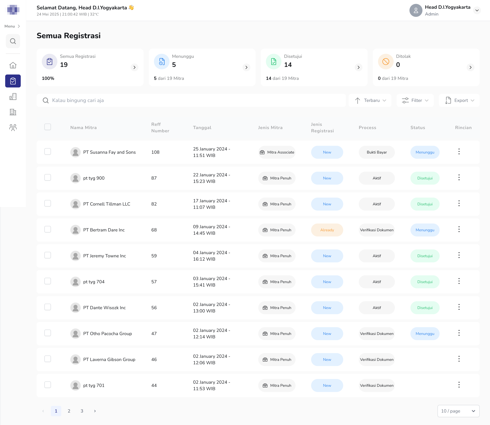

# Privy Customization: Tour-agent Application

<b>Role:</b> Back-End Engineer 
<b>Duration:</b> 7 months

Tour-agent application is a platform designed to facilitate transactions between travelers and Indonesian travel agents. All participating agents are members of the <b>Association of Indonesian Tours and Travel Agencies (ASITA)</b> and hold <b>digital certificates</b> issued by Privy.

<b>Tech Stack</b>

- <b>Backend Language:</b> Go-lang
- <b>Database:</b> PostgreSQL
- <b>Cloud Storage:</b> Google Cloud Storage
- <b>CI/CD & Orchestration:</b> Jenkins, Docker, Kubernetes
- <b>APM:</b> Datadog

### Challenges

When working on this project, a key challenge was understanding and <b>adapting to the existing code</b> from previous development, along with the current business processes and features, before any improvement or fixes could begin.

### Contributions

During that process, we found we needed to <b>redesign the architecture</b>, which involved:

- <b>Adding an API Gateway</b>: Previously, i.e. applications like the Tour dashboard had to go through the Tour-backend instead of Verifier-backend service to get document data. With the API Gateway, the front-end can now directly access data from the relevant source. The API Gateway also acts as an abstraction layer for internal and external communication, significantly improving security.

- <b>Eliminating potential bottlenecks</b>: Originally, the Tour and Verifier dashboard's authentication processes relied on a central "Dolphin" authentication service. The idea was to centralize authentication to be independent and reusable across all applications (Tour landing, Tour, and Verifier dashboard), especially when integrating third-party authenticators like Privy. However, "Dolphin" wasn't directly used by the front-end; it still had to go through each related service. This created a <b>"tightly coupled"</b> service with circular dependencies. Eliminating "Dolphin" became the best solution to reduce risk and development effort.

    <b>Trade-off:</b> Duplicated authentication modules across all services lead to significant maintenance overhead, particularly with third-party integrations. This structure necessitates redundant implementation whenever a new authentication provider is introduced.

- <b>Handling PII (Personally Identifiable Information) data</b>: We needed special handling for PII due to user terms and conditions and Privy's compliance as a personal data manager. Examples of PII include ID cards, tax IDs, and selfies. We first identified and categorized PII data, making it configurable via environment variables. Then, we created a dedicated bucket in <b>Google Cloud Storage</b> for this data, with security and privacy adjusted to meet feature requirements.

### Capabilities Demonstrated

- Proficient in <b>redesigning microservices architecture</b>, enhancing service choreography to boost communication reliability and system maintainability.
- Experienced in designing and <b>implementing API Gateways</b> to centralize API management, strengthening security and maintainability.
- Adept at integrating observability tools like <b>Datadog</b> to enable thorough system monitoring and performance insights.
- Knowledgeable in implementing compliance measures to <b>protect Personally Identifiable Information (PII)</b> and ensure regulatory adherence.

### Architecture

  

    <figure style="width:100%">
        
        <figcaption style="text-align:center"><small>Figure 1. Tour-Dolphin-Verifier architecture</small></figcaption>
    </figure>
  

  

    <figure style="width:100%">
        
        <figcaption style="text-align:center"><small>Figure 2. Tour-Verifier architecture</small></figcaption>
    </figure>
  

### Documentation

<figure style="width:100%">
    
    <figcaption style="text-align:center"><small>Capture 1. Tour Landing</small></figcaption>
</figure>

<figure style="width:100%">
    
    <figcaption style="text-align:center"><small>Capture 2. Tour Login</small></figcaption>
</figure>

<figure style="width:100%">
    
    <figcaption style="text-align:center"><small>Capture 3. Verifier Login</small></figcaption>
</figure>

  

    <figure style="width:100%">
        
        <figcaption style="text-align:center"><small>Capture 4. Verifier Dashboard</small></figcaption>
    </figure>
  

  

    <figure style="width:100%">
        
        <figcaption style="text-align:center"><small>Capture 5. Verifier Registration</small></figcaption>
    </figure>
  

[Back](./)

____

Related articles:

- [The right way to design a clustered ecosystem with the Choreography architecture approach— Medium](https://medium.com/@ymanshur/the-right-way-to-design-a-clustered-ecosystem-with-the-choreography-architecture-approach-9d673e44b07b)
