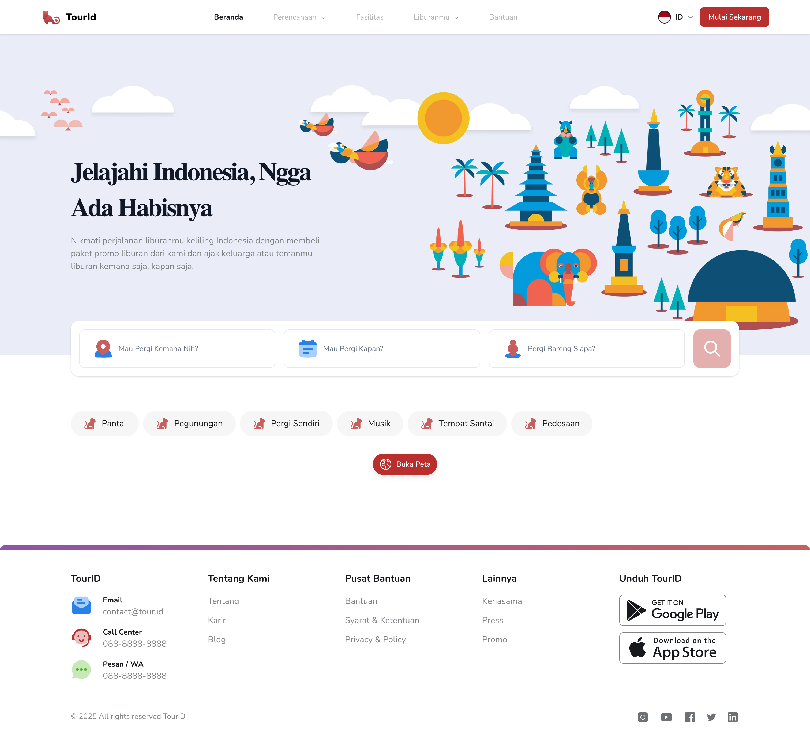
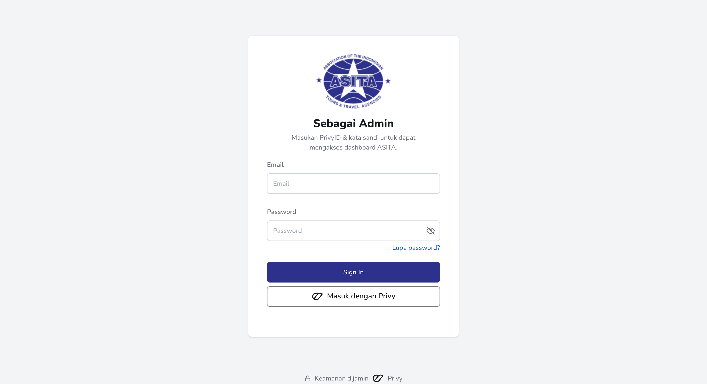
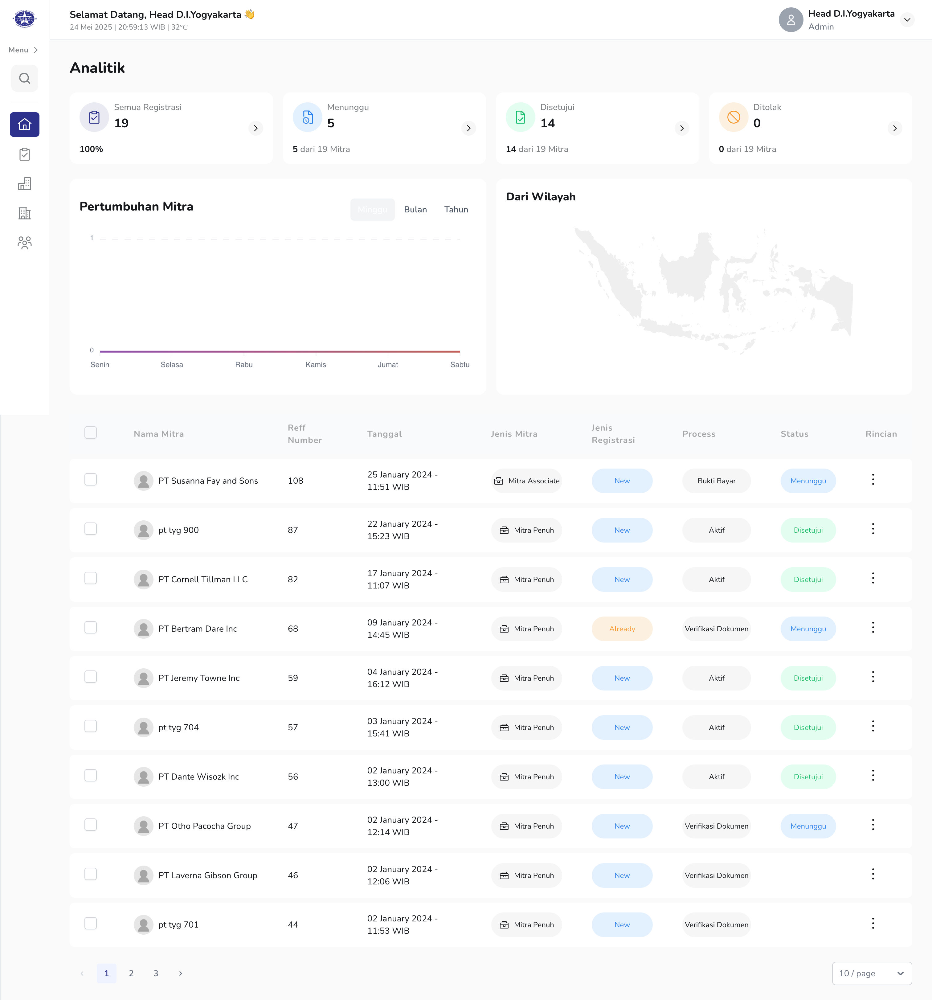
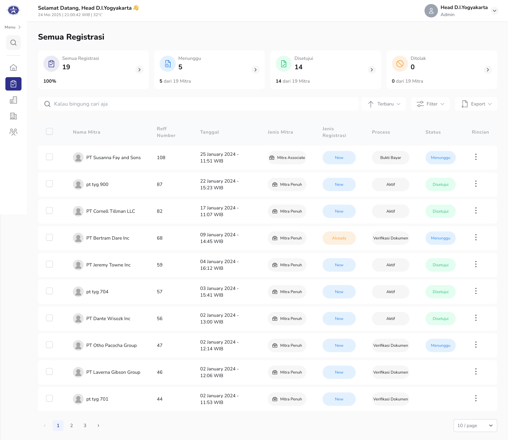

# Privy: TourID x ASITA

## Customization Project: TourID x ASITA

TourID x ASITA is a platform designed to facilitate transactions between travelers and Indonesian travel agents. All participating travel agents are members of the Association of the Indonesian Tours and Travel Agencies (ASITA) and possess **digital certificates issued by Privy**.

**Tech Stack:**

- **Backend Language:** Go-lang
- **Database:** PostgreSQL
- **Cloud Storage:** Google Cloud Storage
- **CI/CD & Orchestration:** Jenkins, Docker

### Initiatives

- **Extensive Refactoring:** Successfully undertook significant refactoring efforts, addressing both architectural design and codebase quality of legacy systems inherited from an outsourced vendor. This involved:
    - **Microservices Architecture Refactoring:** Revamped the existing microservice architecture, specifically improving choreography for enhanced service communication and scalability.
- **Internal API Gateway Implementation:** Designed and implemented an internal API Gateway to centralize and manage API traffic, improving security, performance, and maintainability.
- **Observability Implementation (Datadog):** Integrated Datadog for comprehensive monitoring and observability, providing critical insights into system performance and health.
- **PII Compliance:** Implemented measures to ensure compliance with Personally Identifiable Information (PII) regulations, safeguarding user data.

### Documentation

{:target="_blank"}

{:target="_blank"}

{:target="_blank"}

{:target="_blank"}

{:target="_blank"}

____

Related article: [The right way to design a clustered ecosystem with the Choreography architecture approach— Medium](https://medium.com/@ymanshur/the-right-way-to-design-a-clustered-ecosystem-with-the-choreography-architecture-approach-9d673e44b07b)
