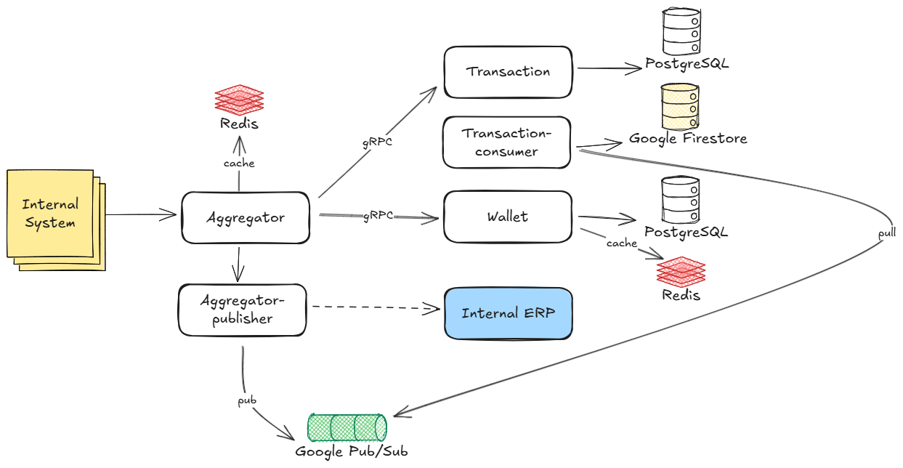

# Privy: Transaction-Wallet System

<b>Role:</b> Back-End Engineer 
<b>Duration:</b> 9 months

Transaction-Wallet is a distributed financial transaction and ledger ecosystem built to orchestrate balance actions (e.g., top-up, usage, void, transfer) and record cost-revenue events to an internal ERP system. The platform consists of two core services:

- <b>Transaction Service</b> – Acts as a data aggregator and executor, handling real-time balance actions and routing financial records to the ERP system.
- <b>Wallet Service</b> – Serves as the centralized ledger, maintaining accurate, auditable records of all user balances and usage activities.

Designed with event-driven principles and optimized for high availability, low latency, and strong consistency across services.

<b>Tech Stack</b>

- <b>Languages:</b> Golang
- <b>Database:</b> PostgreSQL, Google Firestore
- <b>Caching & Messaging:</b> Redis, Google Pub/Sub
- <b>CI/CD & Containerization:</b> GitLab CI, Docker, Kubernetes
- <b>APM:</b> Datadog

### Challenges

- Engineered to handle <b>10,000+ data volumes every 15 minutes</b> with consistent performance under heavy traffic.
- Required strict adherence to <b>CAP principles</b>—balancing consistency, availability, and partition tolerance in a high-concurrency environment.
- Designed flexible schemas to accommodate <b>personal, enterprise hierarchy, and reseller-level wallet models</b>.

### Contributions

- Built both services <b>from scratch</b>, deeply involved in planning, contract definition, system design, and execution.
- Implemented <b>event-driven auto-action execution</b> using worker schedulers and message brokers to automate a transactional workflow.
- Achieved <b>high consistency and integrity</b> in concurrent <b>usage</b> operations by leveraging <b>Redis-based distributed locking</b>, effectively eliminating race conditions.
- Launched a robust <b>Enterprise Account (EA) wallet management/<b> system for top-up, add-on, and extension scenarios.
- Conducted a <b>mass migration of personal balances</b> (L1 to L2) and
- Supported <b>bulk dormant processing</b> for EMAC use cases.
- Supported <b>reseller schemas</b> and specialized dormant workflows by usage IDs for cost-revenue mapping.
- Refactored Enterprise Account-specific features to improve maintainability and modularity.

### Capabilities Demonstrated

- Proficient in building and scaling distributed financial systems with strong transactional guarantees. Achieved <b>over 70 requests per second (RPS)</b> throughput, with <b>95% of 700,000 transactions completing in under 0.7 seconds</b> and <b>zero transaction failures</b> during peak-hour performance testing.
- Deep experience in <b>event-driven architecture</b>, real-time processing, and message-based orchestration.
- Skilled in implementing <b>distributed locks</b>, transactional safety, and performance optimizations for high-throughput systems.
- Able to lead full-lifecycle service development—from initial concept to production-ready deployment.

### Architecture

<figure style="width:100%">
    
    <figcaption style="text-align:center"><small>Figure 1. Transaction-Wallet architecture</small></figcaption>
</figure>

[Back](./)
