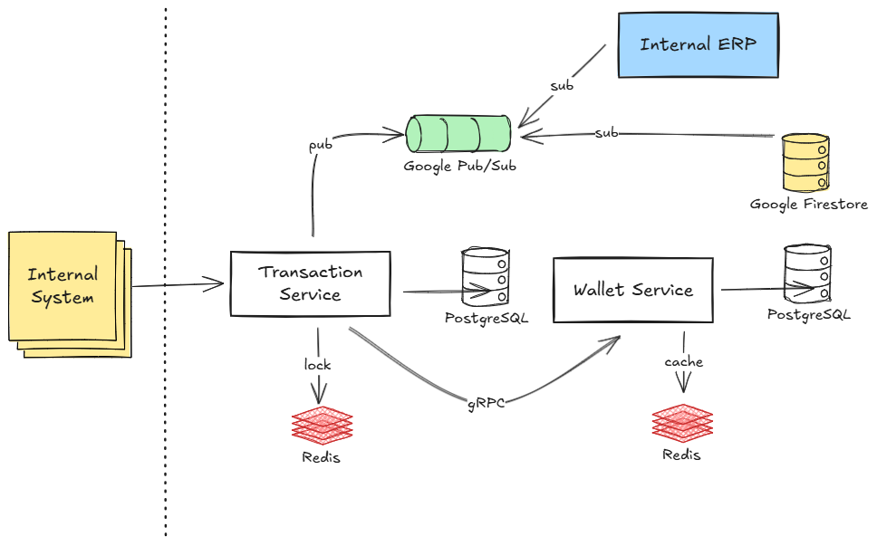

# Privy: Transaction-Wallet System

<b>Role:</b> Back-End Engineer 
<b>Duration:</b> 9 months

### Background

In today’s data driven-landscape, It’s ironic for a digital-first company to struggle with managing its transactional data (including users data)— especially when the data is critical to shaping future business decisions.

A core issue we faced was that <b>the transactional data was scattered</b> across multiple systems, each with its workflow, schema, and logic. This siloed operations made it difficult to consistently <b>track revenue and cost</b> across units and prevented us from forming a cohesive view of user behavior and transactions.

To address this, we introduced the concept of an centralized data ecosystem—<b>an internal “tribe” responsible for transforming disparate data sources</b> into a unified format that aligns with financial reporting requirements and supports accurate business evaluation.

## Core: Transaction & Wallet Services

Transaction-Wallet is a distributed financial transactions and ledger ecosystem built to orchestrate balance actions (e.g., top-up, book, usage, cancel, transfer). Act as <b>single source of truth</b> for financial transactions and record cost-revenue events to an internal ERP system. The platform consists of two core services:

- <b>Transaction Service</b> – Acts as a data aggregator, handling real-time balance actions and routing transactions to the ERP system.
- <b>Wallet Service</b> – Serves as the centralized ledger, maintaining accurate, auditable transactions of all user balances and usage operations.

Designed with event-driven principles and optimized for high availability, low latency, and strong consistency across services.

<b>Tech Stack</b>

- <b>Languages:</b> Golang
- <b>Database:</b> PostgreSQL, Google Firestore
- <b>Caching & Messaging:</b> Redis, Google Pub/Sub
- <b>CI/CD & Containerization:</b> GitLab CI, Docker, Kubernetes
- <b>APM:</b> Datadog

### Challenges

- Develop system that handle <b>10,000+ data volumes every 15 minutes</b> with consistent performance under heavy traffic.
- Design flexible schemas to accommodate <b>personal, enterprise hierarchy, and reseller-level wallet business models</b>.
- Require strict adherence to <b>CAP principles</b>—balancing consistency, availability, and partition tolerance in a high-concurrency environment.

### Contributions

- Built both services <b>from scratch</b>, deeply involved in planning, system design, API contract, technical flow, and implementation.
- Implemented a sophisticated <b>retries and deadline</b> mechanism for balance updates to the Wallet service. This prevents infinite loops in case of persistent issues while ensuring <b>system resiliency</b>.
- Achieved <b>high consistency</b> in concurrent <b>usage</b> actions by leveraging Redis-based <b>distributed locking</b>, effectively eliminating race conditions.
- Implemented <b>message-driven</b> auto-action request using worker schedulers and Redis as a message broker to automate a usage action.
- Engineered a <b>user subscription</b> transactions workflow including checkout-settlement, book-activation, and expired process through payment and platform service.
- Developed a <b>Enterprise Account (EA)</b> wallet management system for assign, un-assign, top-up, add-on, and extension scenarios.
- Developed allocate balances feature with an <b>optimistic lock</b> approach instead of an exclusive lock to reduce blocking and improve concurrency in Wallet service.
- Developed a <b>mass migration</b> of personal balances (transfer L1 to L2) feature
- Engineered bulk dormant <b>balance processing</b> for EMAC (Enterprise, Merchant, Application, Channel) use cases.
- Designed <b>reseller schemas</b> on both EMAC and Personal wallet.

### Capabilities Demonstrated

- Proficient in building and scaling distributed financial systems with strong transactional guarantees. Achieved <b>over 70 requests per second (RPS)</b> throughput, with <b>95% of 300,000 transactions completing in under 0.7 seconds</b> and <b>zero transaction failures</b> during peak-hour performance testing.
- Deep experience in message-driven architecture and <b>real-time processing</b>.
- Skilled in implementing database indexing, distributed locks, data integrity, and performance optimizations for <b>high-throughput system</b>.
- Able to responsibly maintain full-lifecycle development—from initial concept to <b>production-ready deployment</b>.

### Architecture

<figure style="width:100%">
    
    <figcaption style="text-align:center"><small>Figure 1. Transaction-Wallet architecture</small></figcaption>
</figure>

[Back](./)
