# Privy: Transaction-Wallet System

<b>Role:</b> Back-End Engineer 
<b>Duration:</b> 9 months

### Background

In today’s data driven-landscape, It’s ironic for a digital-first company to struggle with managing its transactional data (including users data)— especially when the data is critical to shaping future business decisions.

A core issue we faced was that <b>the transactional data was scattered</b> across multiple systems, each with its workflow, schema, and logic. This siloed operations made it difficult to consistently <b>track revenue and cost</b> across units and prevented us from forming a cohesive view of user behavior and transactions.

To address this, we introduced the concept of an centralized data ecosystem—<b>an internal “tribe” responsible for transforming disparate data sources</b> into a unified format that aligns with financial reporting requirements and supports accurate business evaluation.

## Core: Transaction & Wallet Services

Transaction-Wallet is a distributed financial transactions and ledger ecosystem built to orchestrate balance actions (e.g., top-up, book, usage, cancel, transfer). Act as <b>single source of truth</b> for financial transactions and record cost-revenue events to an internal ERP system. The platform consists of two core services:

- <b>Transaction Service</b> – Acts as a data aggregator, handling real-time balance actions and routing transactions to the ERP system.
- <b>Wallet Service</b> – Serves as the centralized ledger, maintaining accurate, auditable transactions of all user balances and usage operations.

Designed with event-driven principles and optimized for high availability, low latency, and strong consistency across services.

<b>Tech Stack</b>

- <b>Languages:</b> Golang
- <b>Database:</b> PostgreSQL, Google Firestore
- <b>Caching & Messaging:</b> Redis, Google Pub/Sub
- <b>CI/CD & Containerization:</b> GitLab CI, Docker, Kubernetes
- <b>APM:</b> Datadog

### Challenges

- Develop system that handle <b>10,000+ data volumes every 15 minutes</b> with consistent performance under heavy traffic.
- Design flexible schemas to accommodate <b>personal, enterprise hierarchy, and reseller-level wallet business models</b>.
- Require strict adherence to <b>CAP principles</b>—balancing consistency, availability, and partition tolerance in a high-concurrency environment.

### Contributions

- Built both services <b>from scratch</b>, deeply involved in planning, system design, API contract, technical flow, and implementation.
- Implemented a sophisticated <b>retries and deadline</b> mechanism for balance updates to the Wallet service. This prevents infinite loops in case of persistent issues while ensuring <b>system resiliency</b>.
- Achieved <b>high consistency</b> in concurrent <b>usage</b> actions by leveraging Redis-based <b>distributed locking</b>, effectively eliminating race conditions.
- Implemented <b>message-driven</b> auto-action request using worker schedulers and Redis as a message broker to automate a usage action.
- Engineered a <b>user subscription</b> transactions workflow including checkout-settlement, book-activation, and expired process through payment and platform service.
- Developed a <b>Enterprise Account (EA)</b> wallet management system for assign, un-assign, top-up, add-on, and extension scenarios.
- Developed allocate balances feature with an <b>optimistic lock</b> approach instead of an exclusive lock to reduce blocking and improve concurrency in Wallet service.
- Developed a <b>mass migration</b> of personal balances (transfer L1 to L2) feature
- Engineered bulk dormant <b>balance processing</b> for EMAC (Enterprise, Merchant, Application, Channel) use cases.
- Designed <b>reseller schemas</b> on both EMAC and Personal wallet.

### Capabilities Demonstrated

- Proficient in building and scaling distributed financial systems with strong transactional guarantees. Achieved <b>over 70 requests per second (RPS)</b> throughput, with <b>95% of 300,000 transactions completing in under 0.7 seconds</b> and <b>zero transaction failures</b> during peak-hour performance testing.
- Deep experience in message-driven architecture and <b>real-time processing</b>.
- Skilled in implementing database indexing, distributed locks, data integrity, and performance optimizations for <b>high-throughput system</b>.
- Able to responsibly maintain full-lifecycle development—from initial concept to <b>production-ready deployment</b>.

### Architecture

<figure style="width:100%">
    
    <figcaption style="text-align:center"><small>Figure 1. Transaction-Wallet architecture</small></figcaption>
</figure>

# Privy Customization: TourID x ASITA

<b>Role:</b> Back-End Engineer 
<b>Duration:</b> 7 months

TourID is a tour-agent platform designed to facilitate transactions between travelers and Indonesian travel agents. All participating agents are members of the <b>Association of Indonesian Tours and Travel Agencies (ASITA)</b> and hold <b>digital certificates</b> issued by Privy.

<b>Tech Stack</b>

- <b>Backend Language:</b> Go-lang
- <b>Database:</b> PostgreSQL
- <b>Cloud Storage:</b> Google Cloud Storage
- <b>CI/CD & Orchestration:</b> Jenkins, Docker, Kubernetes
- <b>APM:</b> Datadog

### Challenges

When working on this project, a key challenge was understanding and <b>adapting to the existing code</b> from previous development, along with the current business processes and features, before any improvement or fixes could begin.

### Contributions

During that process, we found we needed to <b>redesign the architecture</b>, which involved:

- <b>Adding an API Gateway</b>

  Previously, i.e. applications like the Tour dashboard had to go through the Tour-backend instead of Verifier-backend service to get document data.

  With the API Gateway, the front-end can now directly access data from the relevant source.

  The API Gateway also acts as an abstraction layer for internal and external communication, significantly improving security.

- <b>Eliminating Potential Bottlenecks</b>

  Originally, the Tour and Verifier dashboard's authentication processes relied on a central 'Dolphin' authentication service. The idea was to centralize authentication to be independent and reusable across all applications (TourID landing, TourID, and ASITA dashboard), especially when integrating third-party authenticators like Privy.

  However, Dolphin wasn't directly used by the front-end; it still had to go through each related service. This created a <b>"tightly coupled"</b> service with shared-database and circular dependencies. Eliminating Dolphin became the best solution to reduce risk and development effort.

    <b>Trade-off:</b> Duplicated authentication modules across all services lead to significant maintenance overhead, particularly with third-party integrations. This structure necessitates redundant implementation whenever a new authentication provider is introduced.

- <b>Handling PII (Personally Identifiable Information) Data</b>

  We needed special handling for PII due to user terms and conditions and Privy's compliance as a personal data manager. Examples of PII include ID cards, tax IDs, and selfies. We first identified and categorized PII data, making it configurable via environment variables.

  Then, we created a dedicated bucket in <b>Google Cloud Storage</b> for this data, with security and privacy adjusted to meet feature requirements.

### Capabilities Demonstrated

- Proficient in <b>redesigning microservices architecture</b>, enhancing service choreography to boost communication reliability and system maintainability.
- Experienced in designing and <b>implementing API Gateway</b> to centralize API management, strengthening security and maintainability.
- Adept at integrating observability tools like <b>Datadog</b> to enable thorough system monitoring and performance insights.
- Knowledgeable in implementing compliance measures to <b>protect Personally Identifiable Information (PII)</b> and ensure regulatory adherence.

### Architecture

  

    <figure style="width:100%">
        <a href="images/privy_tour_verifier_dolphin_architecture.png"
        target="_blank"
        rel="noopener noreferrer">
            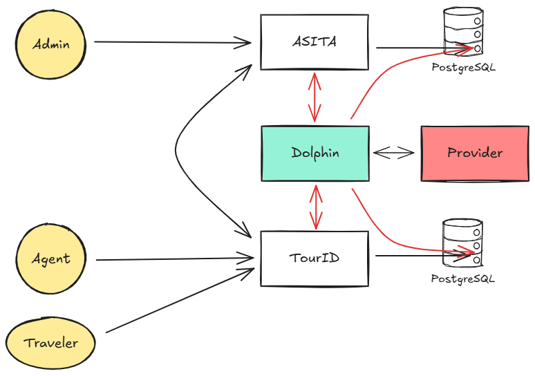
        </a>
        <figcaption style="text-align:center"><small>Figure 1. TourID-ASITA-Dolphin architecture</small></figcaption>
    </figure>
  

  

    <figure style="width:100%">
        <a href="images/privy_tour_verifier_architecture.png"
        target="_blank"
        rel="noopener noreferrer">
            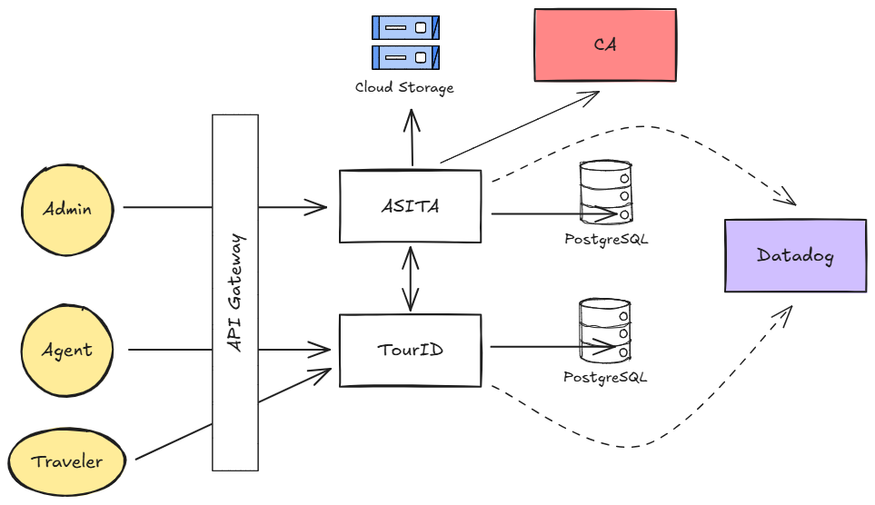
        </a>
        <figcaption style="text-align:center"><small>Figure 2. TourID-ASITA architecture</small></figcaption>
    </figure>
  

### Documentation

<figure style="width:100%">
    <a href="images/privy_tour_landing.png"
    target="_blank"
    rel="noopener noreferrer">
        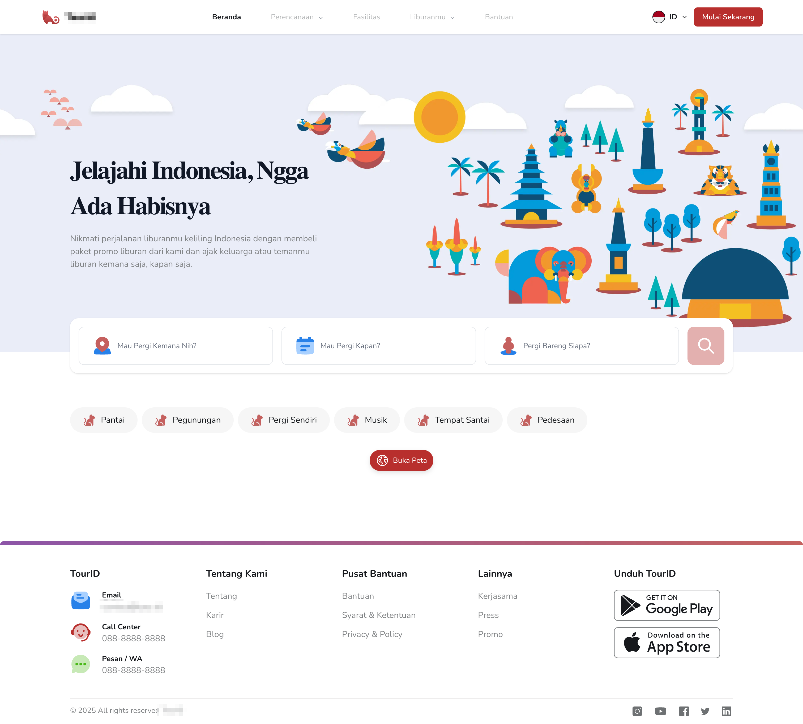
    </a>
    <figcaption style="text-align:center"><small>Capture 1. TourID Landing</small></figcaption>
</figure>

<figure style="width:100%">
    
    <figcaption style="text-align:center"><small>Capture 2. TourID Login</small></figcaption>
</figure>

<figure style="width:100%">
    <a href="images/privy_tour_verifier_login.png"
    target="_blank"
    rel="noopener noreferrer">
        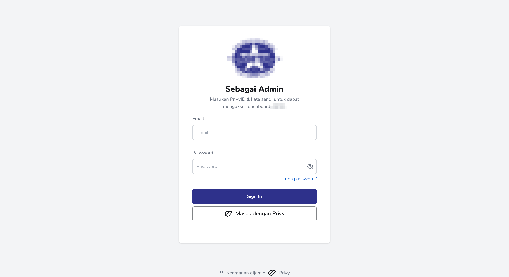
    </a>
    <figcaption style="text-align:center"><small>Capture 3. ASITA Login</small></figcaption>
</figure>

  

    <figure style="width:100%">
        <a href="images/privy_tour_verifier_dashboard.png"
        target="_blank"
        rel="noopener noreferrer">
            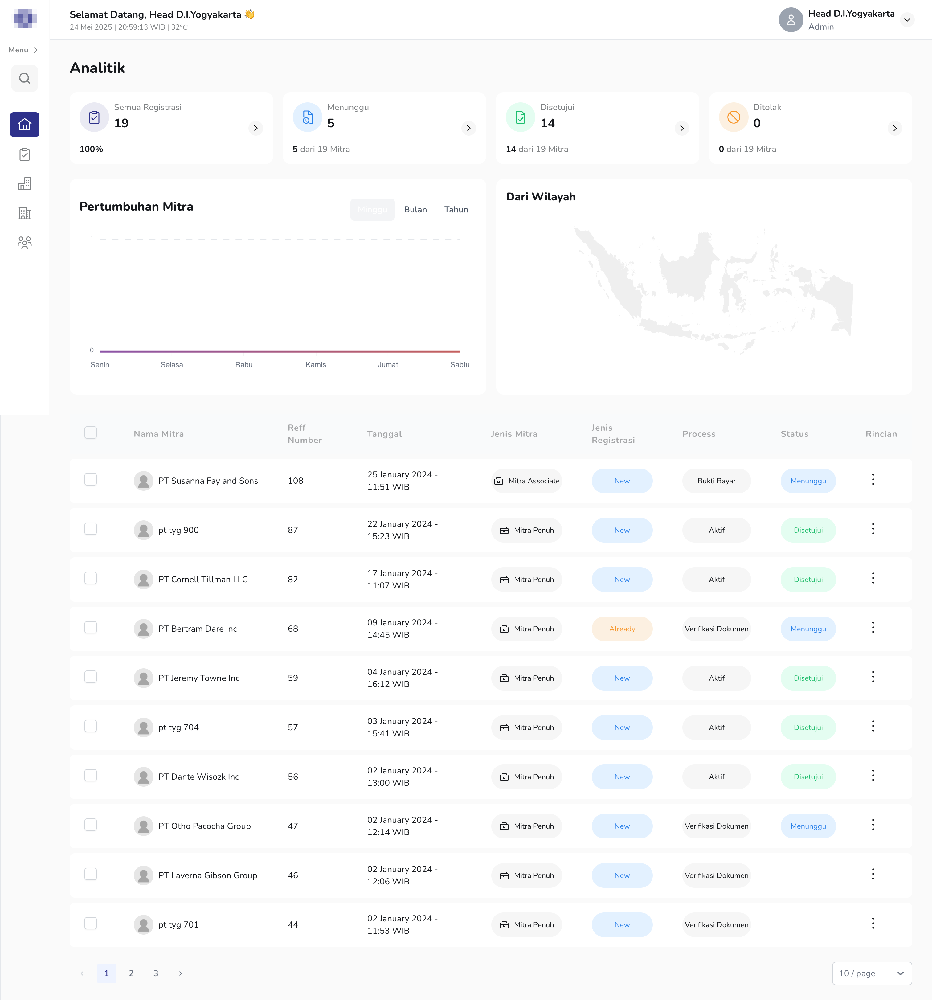
        </a>
        <figcaption style="text-align:center"><small>Capture 4. ASITA Dashboard</small></figcaption>
    </figure>
  

  

    <figure style="width:100%">
        <a href="images/privy_tour_verifier_registration.png"
        target="_blank"
        rel="noopener noreferrer">
            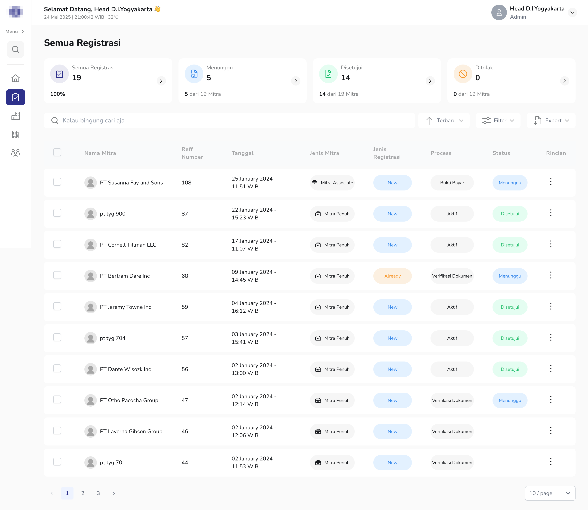
        </a>
        <figcaption style="text-align:center"><small>Capture 5. ASITA Registration</small></figcaption>
    </figure>
  

____

Related articles:

- [The right way to design Tour-agent integration system with long-running transactions pattern— Medium](https://medium.com/@ymanshur/the-right-way-to-design-a-clustered-ecosystem-with-the-choreography-architecture-approach-9d673e44b07b)

# Privy Integration: CRM-ERP Orchestrator

<b>Role:</b> Back-End Engineer 
<b>Duration:</b> 11 months

### Background

At that time, the CRM and ERP platforms operated in silos, with data flows between systems <b>managed manually</b>. This resulted in fragmented workflows, frequent delays, and high potential for human error. Year-end reconciliation was particularly painful—requiring manual data extraction and alignment across disparate data sources, often leading the mismatched opening and closing balances.

Our objective was to establish a unified, <b>automated pipeline</b> across CRM, ERP, and internal platforms. By eliminating manual intervention, we aimed to reduce data drift, improve reporting accuracy, and enable real-time visibility across marketing, sales, finance, and product teams.

To enable this, we required a workflow orchestration layer capable of handling complex, event-driven synchronization. The system needed to support bi-directional data flow, exception handling, and automated triggers—improving <b>data reliability</b> and <b>operational efficiency</b>.

## CRM - ERP GoldenGate

CRM-ERP GoldenGate is a system responsible for <b>orchestrating</b> end-to-end customer interactions including their transactional data—such as top-up, usage, void, and transfer—across internal systems and a third-party platforms. The service acts as a orchestrator ensuring <b>data integrity and near real-time event synchronization</b> to [Zendesk](https://www.zendesk.com), [ActiveCampaign](https://www.activecampaign.com), and [NetSuite Oracle](https://www.apergu.com/netsuiteapergu).

<b>Tech Stack</b>

- <b>Language:</b> Golang
- <b>Database:</b> PostgreSQL, ClickHouse
- <b>Caching & Messaging:</b> Redis, Google Pub/Sub
- <b>CI/CD & Containerization:</b> GitLab CI, Docker, Kubernetes
- <b>APM:</b> Datadog

### Challenges

- Enable CRM-ERP integration and <b>seamlessly synchronized</b> with internal platforms.
- Ensure <b>high consistency</b> and <b>low-latency performance</b> for transaction-heavy workloads under high traffic.
- Deliver shadow balance/subscription logic to maintain <b>transactional accuracy</b> before ERP synchronization.
- Support seamless <b>data migration</b> while maintaining system integrity and uptime.

### Contributions

- Designed and implemented core processes for top-up, transfer, void, and usage balance modules, ensuring accurate <b>ERP integration</b> across multiple business models.
- Built an <b>event-driven</b> orchestration layer to handle various business-specific transaction behaviors with asynchronous <b>communication</b> patterns.
- Developed shadow subscription service that provide <b>usage transactions querying</b> in FIFO and LIFO scenario based on payment setting.
- Introduced <b>distributed scheduler</b> by leveraging Redis distributed locks to handle aggregated daily usage transactions synchronized to ERP.
- Leveraged Redis queue to implement <b>worker-pool mechanism</b> for logs the integration process <b>asynchronously</b>.

### Capabilities Demonstrated

- Experienced in integrating the third-party CRM-ERP systems with strong <b>transaction atomicity</b> guarantees.
- Proficient in providing  robust <b>reactive solutions</b> in Go using Google Pub/Sub and Redis as message brokers.
- Skilled in implementing database partitioning, distributed states, data integrity, and asynchronous process for <b>low-latency</b> systems.

### Architecture

<figure style="width:100%">
    <a href="images/privy_crm_erp_orchestrator_outbound_architecture.png"
       target="_blank"
       rel="noopener noreferrer">
        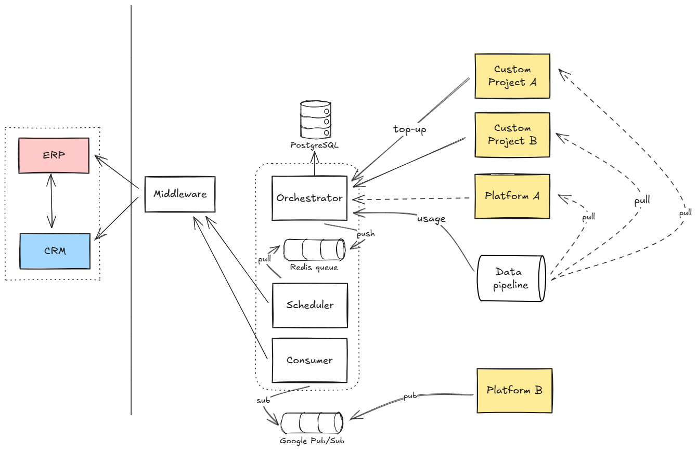
    </a>
    <figcaption style="text-align:center"><small>Figure 1. CRM-ERP Orchestrator outbound architecture</small></figcaption>
</figure>

<figure style="width:100%">
    <a href="images/privy_crm_erp_orchestrator_inbound_architecture.png"
       target="_blank"
       rel="noopener noreferrer">
        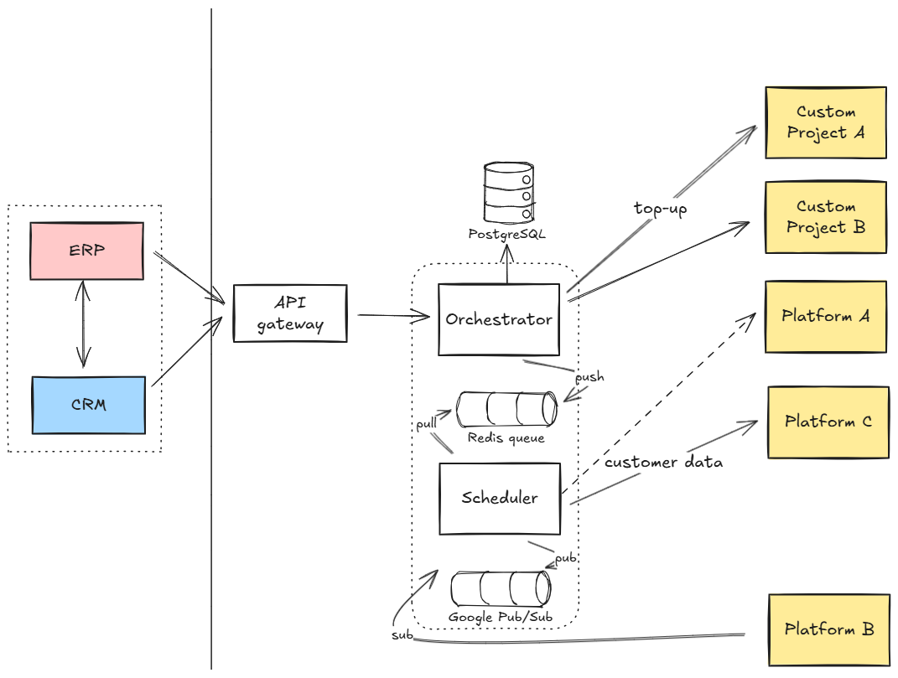
    </a>
    <figcaption style="text-align:center"><small>Figure 2. CRM-ERP Orchestrator inbound architecture</small></figcaption>
</figure>

____

Related articles:

- [When Good Systems Go Unadopted: Lessons from Building an ERP Orchestration Layer— Medium](https://medium.com/@ymanshur/when-good-systems-go-unadopted-lessons-from-building-an-erp-orchestration-layer-2695c238daf4)

# Privy: Midlleware-Warehouse Systems

<b>Role:</b> Back-End Engineer 
<b>Duration:</b> 5 months

Middleware is a centralized portal and gateway that enables integration between multiple client projects and the Privy digital signature platform. This system comprises multiple services, including a warehousing module responsible for <b>managing balance data</b> (e.g., for Signing, E-Meterai, Blast, OTP, etc.). It acts as the transaction backbone, facilitating <b>secure and efficient transactions across services</b>.

<b>Tech Stack</b>

- <b>Languages:</b> Ruby on Rails, Golang
- <b>Database:</b> PostgreSQL
- <b>Caching:</b> Redis
- <b>CI/CD & Containerization:</b> Jenkins, Docker
- <b>APM:</b> Sentry

### Challenges

- Built the system entirely <b>from scratch</b>, including deep involvement in planning, API contract, and architectural design.
- Required strong guarantees in <b>consistency</b>, <b>availability<b>, and <b>low latency</b> for handling high-throughput transactional operations.
- Supported over <b>700,000 accounts</b> with up to <b>12 currencies</b>.

### Contributions

- Prevented race conditions in high-concurrency on transfer balance scenarios by <b>optimistic database locking</b>.
- Designed and implemented a <b>polymorphic data model</b> for extensible balance ownership.
- Improved system availability by <b>denormalized database</b> columns due to high-latency in retrieval query.
- Utilized Redis for real-time balance <b>caching</b>, enabling low-latency client notifications.
- Refactored the system from <b>Ruby on Rails</b> to <b>Go</b> with a <b>clean architecture</b> approach, improving maintainability and performance.

### Capabilities Demonstrated

- Strong understanding of concurrency control and <b>race condition mitigation</b>.
- Skilled in implementing database denormalization for <b>low-latency</b> systems.
- Knowledge and practical application of caching mechanisms (specifically Redis) to improve <b>system responsiveness</b> and <b>reduce database load/<b>.
- Expertise in <b>migrating code</b> from Ruby on Rails to Go.
- Capable of handling system design from <b>planning</b> to production-ready <b>deployment</b>.

### Architecture

<figure style="width:100%">
    <a href="images/privy_middleware_warehouse_architecture.png"
       target="_blank"
       rel="noopener noreferrer">
        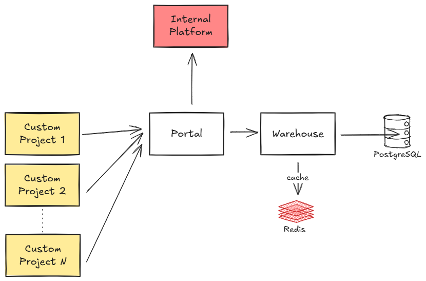
    </a>
    <figcaption style="text-align:center"><small>Figure 1. Middleware - Warehouse architecture</small></figcaption>
</figure>

# Privy Customization: Digital Document Center (DDC)

<b>Role:</b> Back-End Engineer 
<b>Duration:</b> 6 months

The Digital Document Center (DDC) is a comprehensive dashboard to <b>streamline and monitor document lifecycle activities</b>, including upload, distribution (blast), approval, rejection, and electronic signing (both standard and with e-Meterai). This system is seamlessly integrated with Privy, allowing secure and compliant <b>digital signature capabilities</b>.

<b>Tech Stack<b>

- <b>Backend Framework:</b> Ruby on Rails (leveraging Grape API for robust API endpoints)
- <b>Database:</b> PostgreSQL
- <b>CI/CD & Orchestration:</b> Jenkins, Docker
- <b>APM:</b> Sentry

### Contributions

- Implemented a feature for signing documents with <b>custom QR codes</b> using the [HexaPDF](https://hexapdf.gettalong.org) library.
- Developed a <b>top-up or transfer balance API</b>, integrated with two internal systems related to invoicing and warehousing process (e.g., Portal and Sales).
- Built a <b>user management system</b> with 3-level main hierarchical access (Area, Branch, Department), supporting 340+ enterprise users and 250+ departments.
    <figure style="width:50%">
        <a href="images/privy_dcc_user_hierarchy.jpg.png"
        target="_blank"
        rel="noopener noreferrer">
            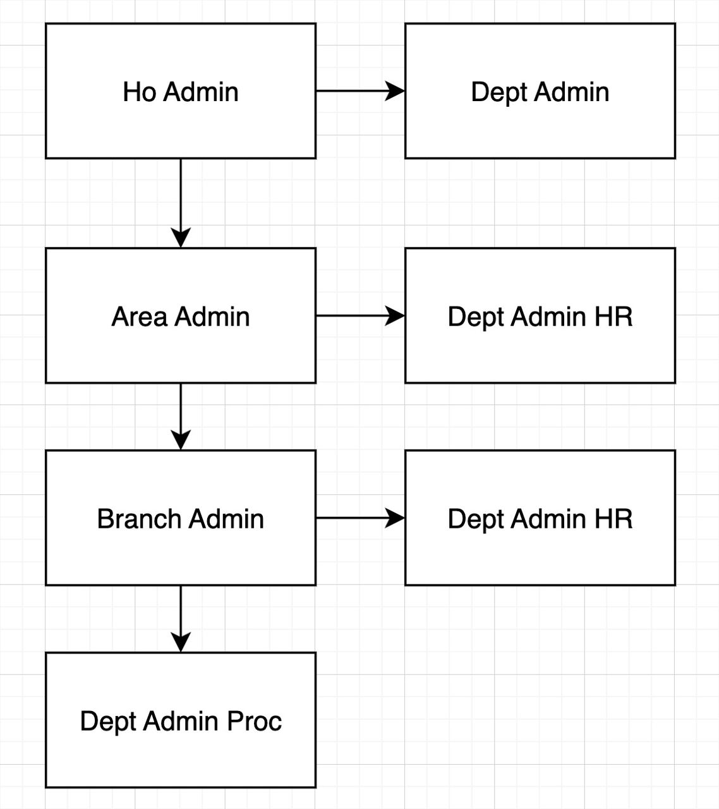
        </a>
        <figcaption style="text-align:center"><small>Illustration 1. User hierarchy</small></figcaption>
    </figure>

### Capabilities Demonstrated

- Quickly adapted to a <b>legacy codebase</b> written in Ruby, a new programming language at the time.
- Proactively aligned all new features and improvements with the existing code patterns and architecture.
- Proficient in building RESTful APIs using <b>Ruby on Rails</b> and <b>Grape API</b> (micro-framework).
- Experienced in <b>integrating third-party services</b> (e.g., e-materai and digital signatures with Privy).
- Strong understanding of enterprise <b>user management</b> and multi-level permission systems.
- Familiar with <b>CI/CD pipelines</b> and container orchestration using Jenkins and Docker.

### Documentation

<figure style="width:100%">
    <a href="images/privy_dcc_document_ongoing.png"
    target="_blank"
    rel="noopener noreferrer">
        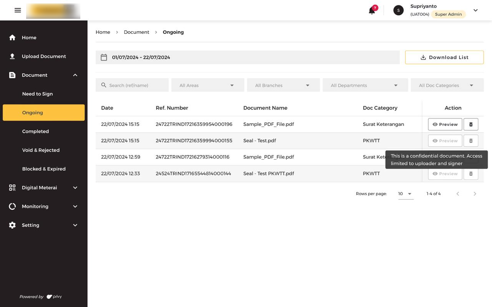
    </a>
    <figcaption style="text-align:center"><small>Capture 1. Document Ongoing</small></figcaption>
</figure>

<figure style="width:100%">
    <a href="images/privy_dcc_document_completed.png"
    target="_blank"
    rel="noopener noreferrer">
        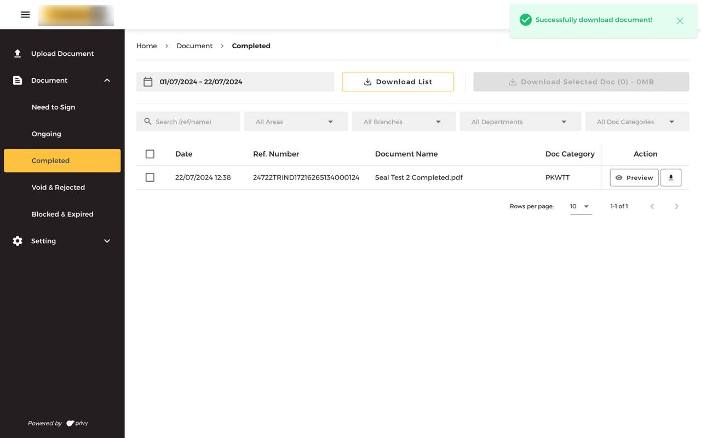
    </a>
    <figcaption style="text-align:center"><small>Capture 2. Document Completed</small></figcaption>
</figure>

<figure style="width:100%">
    <a href="images/privy_dcc_document_completed_preview.png"
    target="_blank"
    rel="noopener noreferrer">
        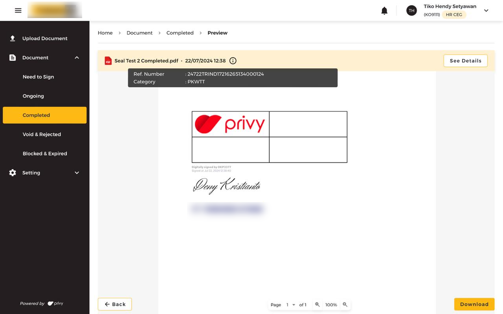
    </a>
    <figcaption style="text-align:center"><small>Capture 3. Document Completed Preview</small></figcaption>
</figure>

<figure style="width:100%">
    <a href="images/privy_dcc_document_void_reject.png"
    target="_blank"
    rel="noopener noreferrer">
        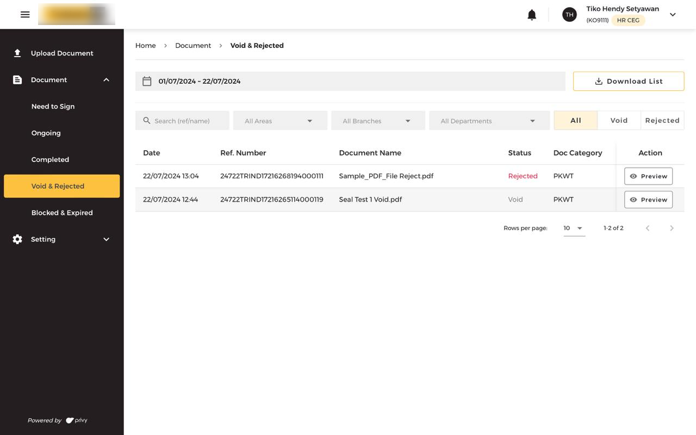
    </a>
    <figcaption style="text-align:center"><small>Capture 4. Document Void & Reject</small></figcaption>
</figure>

  

    <figure style="width:100%">
        <a href="images/privy_dcc_balance_transfer.png"
        target="_blank"
        rel="noopener noreferrer">
            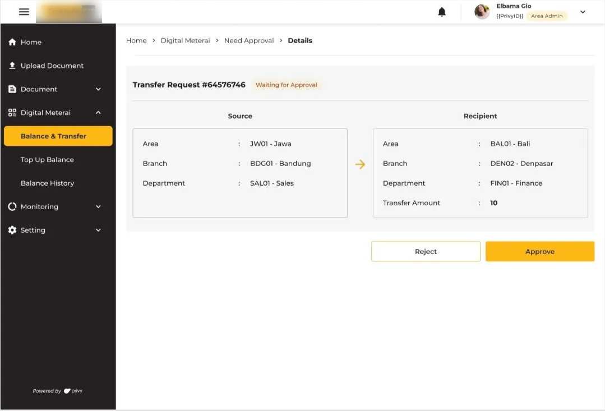
        </a>
        <figcaption style="text-align:center"><small>Capture 5. Balance Transfer</small></figcaption>
    </figure>
  

  

    <figure style="width:100%">
        <a href="images/privy_dcc_balance_top_up.jpg"
        target="_blank"
        rel="noopener noreferrer">
            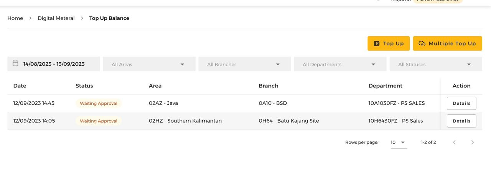
        </a>
        <figcaption style="text-align:center"><small>Capture 6. Balance Top-Up</small></figcaption>
    </figure>
  

<figure style="width:100%">
    <a href="images/privy_dcc_user_setting.png"
    target="_blank"
    rel="noopener noreferrer">
        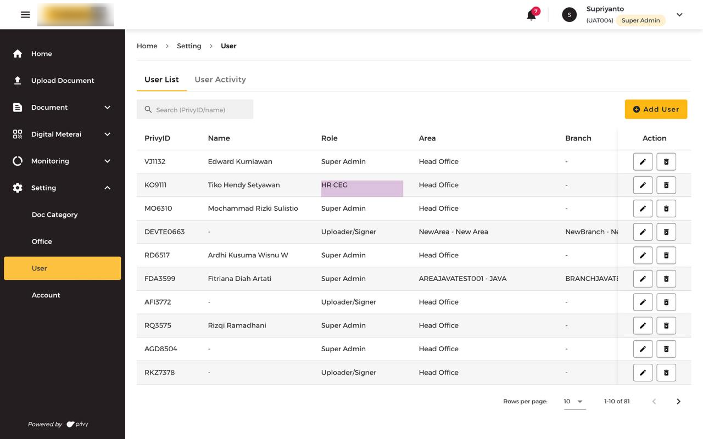
    </a>
    <figcaption style="text-align:center"><small>Capture 7. User Setting</small></figcaption>
</figure>

<figure style="width:100%">
    <a href="images/privy_dcc_http_logs.png"
    target="_blank"
    rel="noopener noreferrer">
        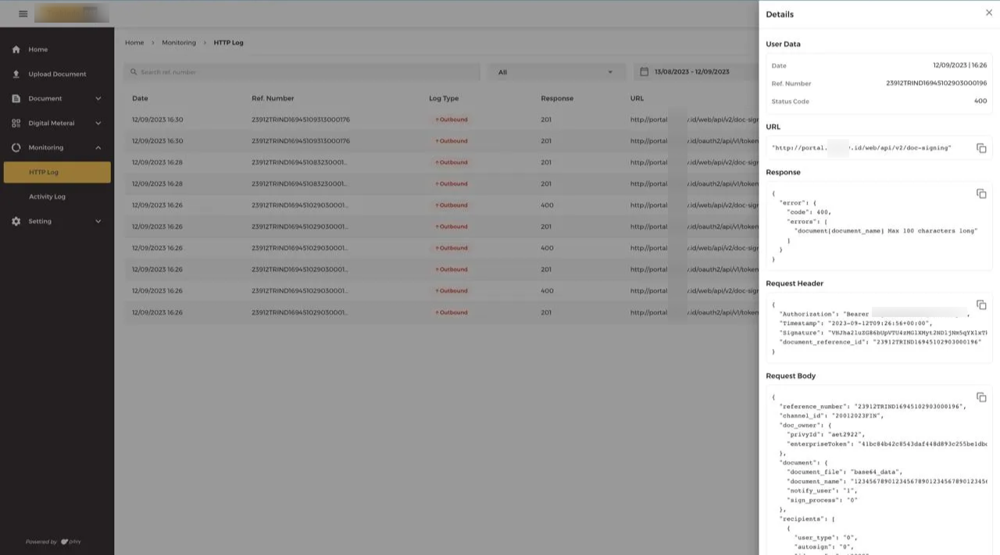
    </a>
    <figcaption style="text-align:center"><small>Capture 8. HTTP Logs</small></figcaption>
</figure>

# Widya Analytic: Documentation Platform

<b>Role:</b> Technical Writer 
<b>Duration:</b> 2 months

The Widya Analytic Documentation platform, serves as a centralized and structured knowledge base for all product and engineering documentations. It <b>consolidates critical information</b> such as High-Level Architecture (HLA) diagrams, API specifications, and service sequence diagrams, ensuring alignment between engineering and product teams. This platform was designed to support clarity and accessibility as Widya Analytic's systems evolved.

<b>Tech Stack:</b> Markdown, Sphinx

### Contributions

- Developed and maintained a comprehensive documentation portal with [Sphinx](https://www.sphinx-doc.org/), covering all major <b>system components</b> and <b>development workflows</b>.
- <b>Standardized documentation structure</b> across teams, improving consistency, readability, and ease of navigation.
- Documented <b>High-Level Architectures (HLA)</b>, <b>APIs</b>, and <b>service interactions</b>, enabling faster understanding and onboarding for internal stakeholders.
- Improved <b>developer experience</b> by ensuring all technical references were up-to-date, version-controlled, and easily accessible.
- Enhanced <b>visual communication</b> through integrated diagrams that clearly illustrated system flows and dependencies.

### Capabilities Demonstrated

- Proficient in building <b>centralized documentation</b> platforms, consolidating system architecture, API references, and service diagrams to support cross-team alignment.
- Skilled in <b>visualizing</b> and <b>documenting</b> architecture and technical flows, making complex systems more accessible to developers and product teams.
- Experienced in defining and maintaining <b>standardized documentation</b> practices, improving clarity, reducing onboarding time, and ensuring up-to-date technical references.

### Documentation

<figure style="width:100%">
    <a href="images/2022_widya_analytic_doc_architecture.png"
    target="_blank"
    rel="noopener noreferrer">
        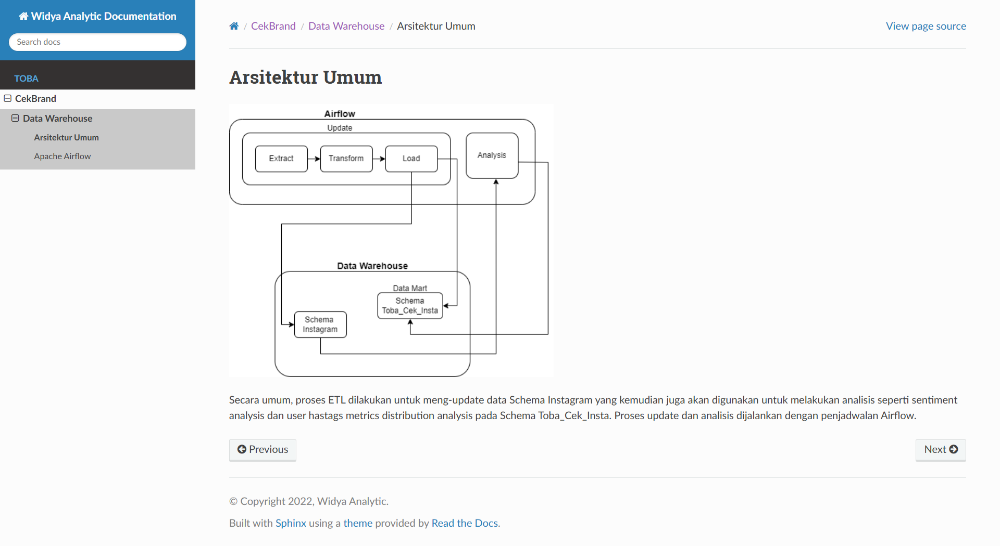
    </a>
    <figcaption style="text-align:center"><small>Capture 1. Documentation - ETL Architecture</small></figcaption>
</figure>

  

    <figure style="width:100%">
        <a href="images/2022_widya_analytic_doc_feature_dashboard.png"
        target="_blank"
        rel="noopener noreferrer">
            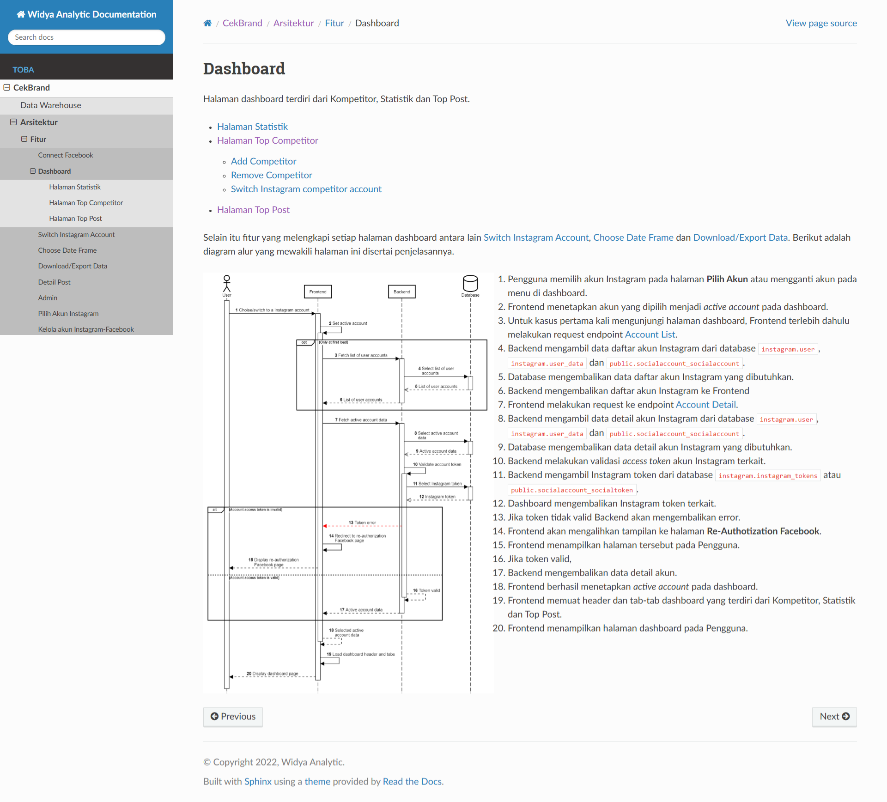
        </a>
        <figcaption style="text-align:center"><small>Capture 2. Documentation - Dashboard</small></figcaption>
    </figure>
  

  

    <figure style="width:100%">
        <a href="images/2022_widya_analytic_doc_feature_connect_facebook.png"
        target="_blank"
        rel="noopener noreferrer">
            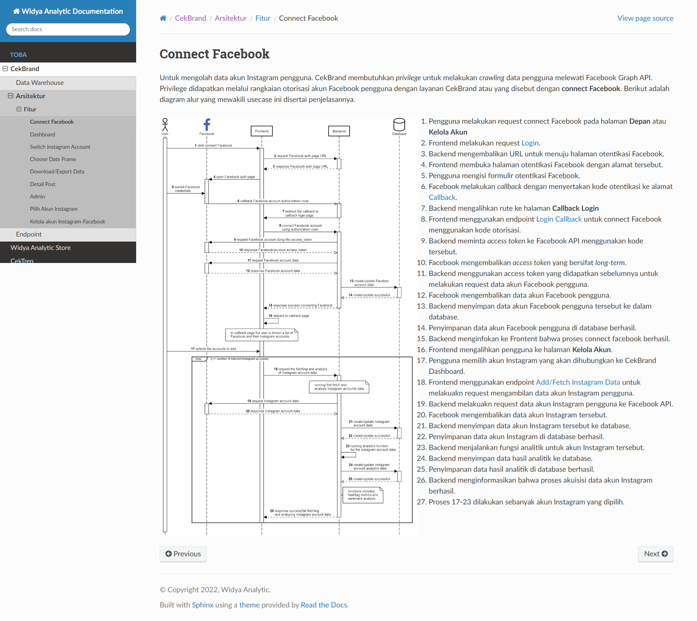
        </a>
        <figcaption style="text-align:center"><small>Capture 3. Documentation - Connect Facebook</small></figcaption>
    </figure>
  

<figure style="width:100%">
    <a href="images/2022_widya_analytic_doc_endpoint.png"
    target="_blank"
    rel="noopener noreferrer">
        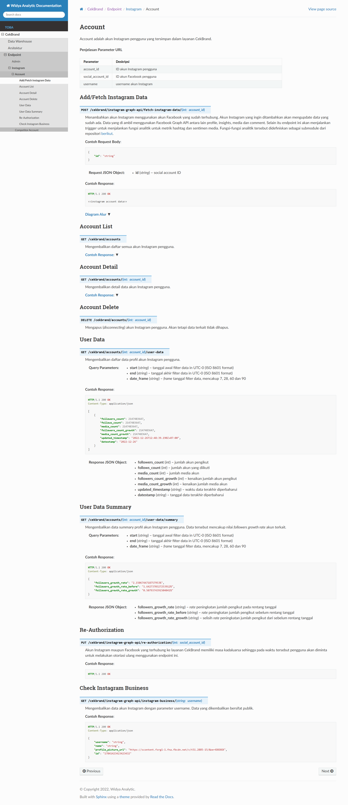
    </a>
    <figcaption style="text-align:center"><small>Capture 4. Documentation - Endpoint</small></figcaption>
</figure>

# Widya Analytic: Store Platform

<b>Role:</b> Full-Stack Engineer 
<b>Duration:</b> 8 months

A comprehensive web platform that hosts the <b>Widya Analytic product store</b>, blog access— integrated with WordPress CMS, and event registration. The platform supports seamless purchases transactions, and Single Sign-On (SSO) for user authentication across all Widya Analytic products.

<b>Tech Stack</b>

- <b>Frontend:</b> Vue.js
- <b>Backend:</b> Django REST Framework
- <b>Databases:</b> PostgreSQL, MongoDB
- <b>Third-Party Integrations:</b> Midtrans (Online Payment Gateway)

### Contributions

- Developed a <b>product store API</b> with integrated <b>online payment</b> using <https://midtrans.com/id>, enabling seamless transactions for digital products.
- Built an <b>SSO (Single Sign-On) authentication system</b> to unify user sessions across all Widya Analytic platforms, improving user experience and access control.
- Implemented an <b>Event Management API</b> using <b>MongoDB</b> to handle dynamic, unstructured event-related data with high flexibility.
- Contributed an <b>internal ReactJS dashboard</b> (another platform) for monitoring and managing all product payment transactions, providing key insights and operational oversight.

### Capabilities Demonstrated

- Full-stack development across <b>multiple frameworks and technologies</b> (Vue, React, Django, PostgreSQL, MongoDB).
- Experience integrating secure <b>third-party payment systems</b>.
- Designed cross-platform <b>SSO architecture</b>e to centralize authentication flows.

### Architecture

<figure style="width:100%">
    <a href="images/widya_analytic_store_architecture.png"
    target="_blank"
    rel="noopener noreferrer">
        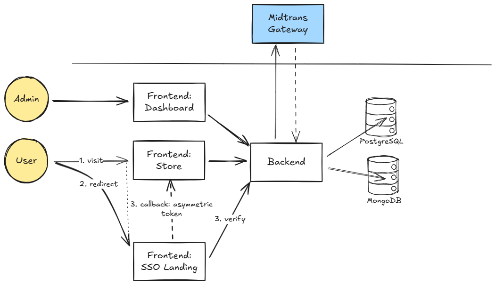
    </a>
    <figcaption style="text-align:center"><small>Figure 1. Widya Analytic Store - Architecture</small></figcaption>
</figure>

### Documentation

<figure style="width:100%">
    <a href="images/2021_widya_analytic_store_banner.png"
    target="_blank"
    rel="noopener noreferrer">
        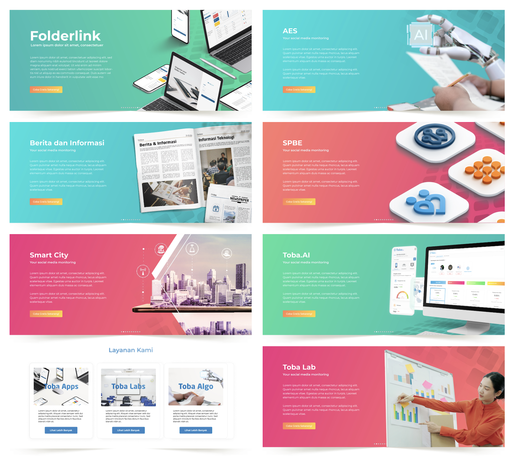
    </a>
    <figcaption style="text-align:center"><small>Capture 1. Widya Analytic Store - Banner</small></figcaption>
</figure>

# Widya Analytic: Toba.AI

<b>Role:</b> Full-Stack Engineer 
<b>Duration:</b> 2 years

Toba.AI is Widya Analytic’s flagship product that leverages artificial intelligence for <b>social media benchmarking</b>, <b>trend recognition</b>, and <b>text sentiment analysis</b>. The system implements a robust ETL pipeline using Apache Airflow to crawl data from external sources, load data into a centralized data lake, and transform it into structured formats for downstream analysis.

<b>Tech Stack</b>

- <b>Frontend:</b> Vue.js
- <b>Backend:</b> Django REST Framework
- <b>Databases:</b> PostgreSQL

### Contributions

- Engineered backend APIs to deliver <b>analytical insights</b> from Instagram account data, powering <b>visualizations</b> and metrics across the 'Audiens', 'Kompetitor', and 'Performa' dashboard.
- Built <b>complex query</b> logic to perform multi-dimensional aggregation, including time-series breakdowns, sentiment tracking, and statistical number.
- Ensured high-performance delivery of insights by <b>optimizing query<b> structures and <b>schema designs<b> (_materialized view_) within PostgreSQL to handle large-scale analytical workloads.

### Capabilities Demonstrated

- Skilled in designing and developing RESTful APIs that serve <b>complex analytical data</b>, enabling insight-driven user experiences through visual dashboards and metrics.
- Experienced in crafting complex SQL queries to perform <b>multi-dimensional data aggregation</b> (data cube).

### Architecture

<figure style="width:100%">
    
    <figcaption style="text-align:center"><small>Figure 1. Widya Analytic Toba.AI - Architecture</small></figcaption>
</figure>

### Documentation

<figure style="width:100%">
    
    <figcaption style="text-align:center"><small>Capture 1. Toba.AI V0</small></figcaption>
</figure>

  

    <figure style="width:100%">
        
        <figcaption style="text-align:center"><small>Capture 2. Toba.AI V1 - Brand List</small></figcaption>
    </figure>
  

  

    <figure style="width:100%">
        
        <figcaption style="text-align:center"><small>Capture 3. Toba.AI V1 - Brand Detail</small></figcaption>
    </figure>
  

  

    <figure style="width:100%">
        
        <figcaption style="text-align:center"><small>Capture 4. Toba.AI V2 - Audiens</small></figcaption>
    </figure>
  

  

    <figure style="width:100%">
        
        <figcaption style="text-align:center"><small>Capture 5. Toba.AI V2 - Kompetitor</small></figcaption>
    </figure>
  

  

    <figure style="width:100%">
        
        <figcaption style="text-align:center"><small>Capture 6. Toba.AI V2 - Performa</small></figcaption>
    </figure>
  

