# Privy: Transaction-Wallet

<b>Role:</b> Back-End Engineer 
<b>Duration:</b> 9 months

### Background

In today’s data driven-landscape, It’s ironic for a digital-first company to struggle with managing its own internal data (including users data)— especially when the data is critical to shaping future business decisions.

A core issue we faced was that <b>the internal data was scattered across multiple systems</b>, each with its own workflow, schema, and logic. This siloed operations made it <b>difficult to consistently track profit and loss</b> across units and prevented us from forming a cohesive view of user behavior and transactions.

To address this, we introduced the concept of an centralized data ecosystem—<b>an internal “tribe” responsible for transforming disparate data sources</b> into a unified format that aligns with  financial reporting requirements  and supports accurate business evaluation.

## Transaction Wallet Services

Transaction-Wallet is a distributed financial transactions and ledger ecosystem built to orchestrate balance actions (e.g., top-up, book, usage, cancel, transfer) and record cost-revenue events to an internal ERP system. The platform consists of two core services:

- <b>Transaction Service</b> – Acts as a data aggregator, handling real-time balance actions and routing transactions to the ERP system.
- <b>Wallet Service</b> – Serves as the centralized ledger, maintaining accurate, auditable transactions of all user balances and usage operations.

Designed with event-driven principles and optimized for high availability, low latency, and strong consistency across services.

<b>Tech Stack</b>

- <b>Languages:</b> Golang
- <b>Database:</b> PostgreSQL, Google Firestore
- <b>Caching & Messaging:</b> Redis, Google Pub/Sub
- <b>CI/CD & Containerization:</b> GitLab CI, Docker, Kubernetes
- <b>APM:</b> Datadog

### Challenges

- Designed  to handle <b>10,000+ data volumes every 15 minutes</b> with consistent performance under heavy traffic.
- Designed flexible schemas to accommodate <b>personal, enterprise hierarchy, and reseller-level wallet business models</b>.
- Required strict adherence to <b>CAP principles</b>—balancing consistency, availability, and partition tolerance in a high-concurrency environment.

### Contributions

- Built both services <b>from scratch</b>, deeply involved in planning, system design, API contract, technical flow, and implementation.
- Achieved <b>high consistency and integrity</b> in concurrent <b>usage</b> actions by leveraging <b>Redis-based distributed locking</b>, effectively eliminating race conditions.
- Implemented <b>event-driven auto-action request</b> using worker schedulers and message brokers to automate a transactional workflow.
- Engineered a <b>user subscription</b> transactions workflow including checkout-settlement ,book-activation, and expired process through payment and platform service.
- Developed a <b>Enterprise Account (EA) wallet management</b> system for assign, un-assign, top-up, add-on, and extension scenarios.
- Developed a <b>mass migration of personal balances</b> (transfer L1 to L2) feature
- Engineered <b>bulk dormant balance processing</b> for EMAC (Enterprise, Merchant, Application, Channel) use cases.
- Designed <b>reseller schemas</b> on both EMAC and Personal wallet.

### Capabilities Demonstrated

- Proficient in building and scaling distributed financial systems with strong transactional guarantees. Achieved <b>over 70 requests per second (RPS)</b> throughput, with <b>95% of 700,000 transactions completing in under 0.7 seconds</b> and <b>zero transaction failures</b> during peak-hour performance testing.
- Deep experience in <b>event-driven architecture</b> and real-time processing.
- Skilled in implementing <b>distributed locks</b>, <b>transactional consistency</b>, and <b>performance optimizations</b> for high-throughput systems.
- Able to responsibly <b>maintain full-lifecycle service</b>—from initial concept to production-ready deployment.

### Architecture

<figure style="width:100%">
    
    <figcaption style="text-align:center"><small>Figure 1. Transaction-Wallet architecture</small></figcaption>
</figure>

____

# Privy Integration: CRM - ERP Orchestrator

<b>Role:</b> Back-End Engineer 
<b>Duration:</b> 11 months

### Background

At that time, the CRM and ERP platforms operated in silos, with <b>data flows between systems managed manually</b>. This resulted in fragmented workflows, frequent delays, and high potential for human error. Year-end reconciliation was particularly painful—requiring manual data extraction and alignment across disparate data sources, often leading the mismatched opening and closing balances.

Our objective was to establish a unified, <b>automated pipeline across CRM, ERP, and internal platforms</b>. By eliminating manual intervention, we aimed to reduce data drift, improve reporting accuracy, and enable real-time visibility across marketing, sales, finance, and product teams.

To enable this, we required a workflow orchestration layer capable of handling complex, event-driven synchronization. The system needed to support bi-directional data flow, exception handling, and automated triggers—improving <b>data reliability and operational efficiency</b>.

## CRM - ERP GoldenGate

CRM-ERP GoldenGate is a backend service responsible for <b>orchestrating end-to-end customer interactions including their transactional data</b>—such as top-up, usage, void, and transfer—across internal systems and a third-party platforms. The service acts as a orchestrator ensuring <b>data integrity and near real-time event synchronization</b> to [Zendesk](https://www.zendesk.com), [ActiveCampaign](https://www.activecampaign.com), and [NetSuite Oracle](https://www.apergu.com/netsuiteapergu).

<b>Tech Stack</b>

- <b>Language:</b> Golang
- <b>Database:</b> PostgreSQL
- <b>Caching & Messaging:</b> Redis, Google Pub/Sub
- <b>CI/CD & Containerization:</b> GitLab CI, Docker, Kubernetes
- <b>APM:</b> Datadog

### Challenges

- Ensured <b>high consistency and low-latency performance</b> for transaction-heavy workloads under high traffic.
- Delivered shadow balance/subscription logic to <b>maintain transactional accuracy</b> before ERP synchronization.
- Supported <b>seamless data migration</b> while maintaining system integrity and uptime.

### Contributions

- Designed and implemented core processes for top-up, transfer, void, and usage balance modules, <b>ensuring accurate ERP integration</b> across multiple business models.
- Built an <b>event-driven orchestration</b> layer to handle various business-specific transaction behaviors with asynchronous communication patterns.

### Capabilities Demonstrated

- Proficient in building robust <b>event-driven architecture</b> in <b>Go</b> using <b>Google Pub/Sub</b> and <b>Redis</b> as message brokers.
- Experienced in <b>integrating the third-party CRM-ERP systems</b> with strong data consistency guarantees.

### Architecture

<figure style="width:100%">
    
    <figcaption style="text-align:center"><small>Figure 1. CRM-ERP Orchestrator outbound architecture</small></figcaption>
</figure>

<figure style="width:100%">
    
    <figcaption style="text-align:center"><small>Figure 2. CRM-ERP Orchestrator inbound architecture</small></figcaption>
</figure>
____

Related articles:

- [When Good Systems Go Unadopted: Lessons from Building an ERP Orchestration Layer— Medium](https://medium.com/@ymanshur/when-good-systems-go-unadopted-lessons-from-building-an-erp-orchestration-layer-2695c238daf4)

____

# Privy Customization: Tour-agent Application

<b>Role:</b> Back-End Engineer 
<b>Duration:</b> 7 months

Tour-agent application is a platform designed to facilitate transactions between travelers and Indonesian travel agents. All participating agents are members of the <b>Association of Indonesian Tours and Travel Agencies (ASITA)</b> and hold <b>digital certificates</b> issued by Privy.

<b>Tech Stack</b>

- <b>Backend Language:</b> Go-lang
- <b>Database:</b> PostgreSQL
- <b>Cloud Storage:</b> Google Cloud Storage
- <b>CI/CD & Orchestration:</b> Jenkins, Docker, Kubernetes
- <b>APM:</b> Datadog

### Challenges

When working on this project, a key challenge was understanding and <b>adapting to the existing code</b> from previous development, along with the current business processes and features, before any improvement or fixes could begin.

### Contributions

During that process, we found we needed to <b>redesign the architecture</b>, which involved:

- <b>Adding an API Gateway</b>: Previously, i.e. applications like the Tour dashboard had to go through the Tour-backend instead of Verifier-backend service to get document data. With the API Gateway, the front-end can now directly access data from the relevant source. The API Gateway also acts as an abstraction layer for internal and external communication, significantly improving security.

- <b>Eliminating potential bottlenecks</b>: Originally, the Tour and Verifier dashboard's authentication processes relied on a central "Dolphin" authentication service. The idea was to centralize authentication to be independent and reusable across all applications (Tour landing, Tour, and Verifier dashboard), especially when integrating third-party authenticators like Privy. However, "Dolphin" wasn't directly used by the front-end; it still had to go through each related service. This created a <b>"tightly coupled"</b> service with circular dependencies. Eliminating "Dolphin" became the best solution to reduce risk and development effort.

    <b>Trade-off:</b> Duplicated authentication modules across all services lead to significant maintenance overhead, particularly with third-party integrations. This structure necessitates redundant implementation whenever a new authentication provider is introduced.

- <b>Handling PII (Personally Identifiable Information) data</b>: We needed special handling for PII due to user terms and conditions and Privy's compliance as a personal data manager. Examples of PII include ID cards, tax IDs, and selfies. We first identified and categorized PII data, making it configurable via environment variables. Then, we created a dedicated bucket in <b>Google Cloud Storage</b> for this data, with security and privacy adjusted to meet feature requirements.

### Capabilities Demonstrated

- Proficient in <b>redesigning microservices architecture</b>, enhancing service choreography to boost communication reliability and system maintainability.
- Experienced in designing and <b>implementing API Gateways</b> to centralize API management, strengthening security and maintainability.
- Adept at integrating observability tools like <b>Datadog</b> to enable thorough system monitoring and performance insights.
- Knowledgeable in implementing compliance measures to <b>protect Personally Identifiable Information (PII)</b> and ensure regulatory adherence.

### Architecture

  

    <figure style="width:100%">
        
        <figcaption style="text-align:center"><small>Figure 1. Tour-Dolphin-Verifier architecture</small></figcaption>
    </figure>
  

  

    <figure style="width:100%">
        <a href="images/privy_tour_verifier_architecture.png"
        target="_blank"
        rel="noopener noreferrer">
            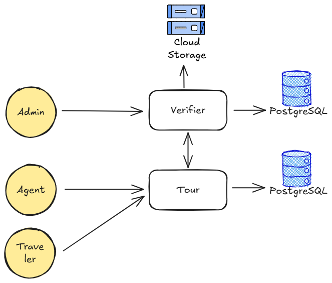
        </a>
        <figcaption style="text-align:center"><small>Figure 2. Tour-Verifier architecture</small></figcaption>
    </figure>
  

### Documentation

<figure style="width:100%">
    
    <figcaption style="text-align:center"><small>Capture 1. Tour Landing</small></figcaption>
</figure>

<figure style="width:100%">
    
    <figcaption style="text-align:center"><small>Capture 2. Tour Login</small></figcaption>
</figure>

<figure style="width:100%">
    <a href="images/privy_tour_verifier_login.png"
    target="_blank"
    rel="noopener noreferrer">
        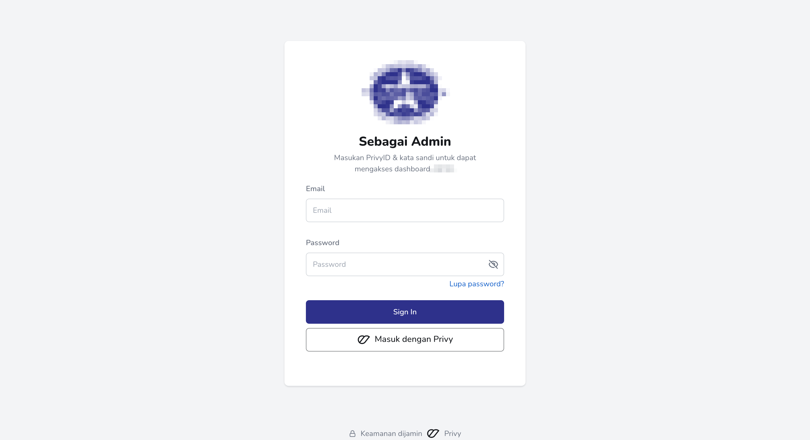
    </a>
    <figcaption style="text-align:center"><small>Capture 3. Verifier Login</small></figcaption>
</figure>

  

    <figure style="width:100%">
        <a href="images/privy_tour_verifier_dashboard.png"
        target="_blank"
        rel="noopener noreferrer">
            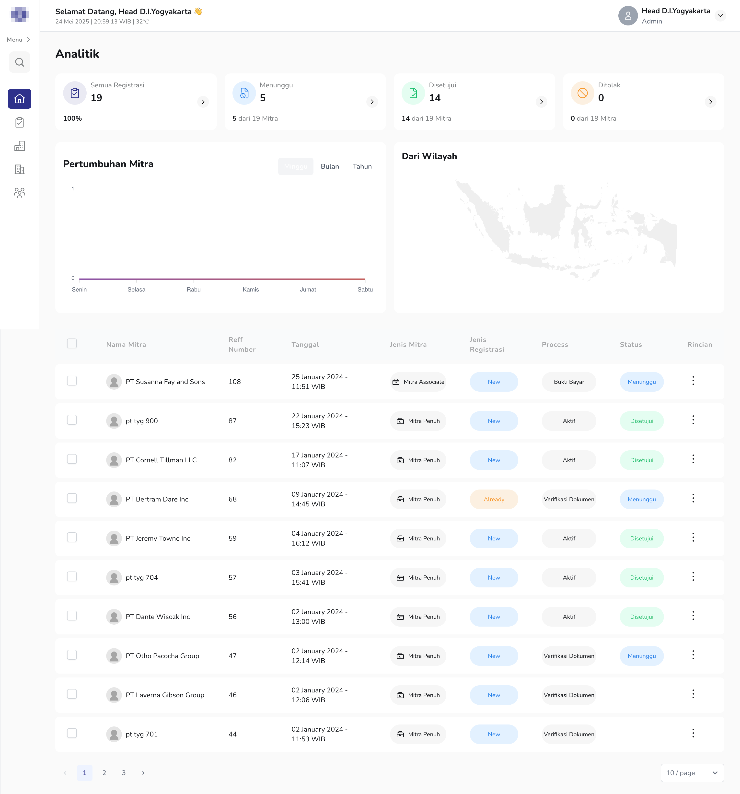
        </a>
        <figcaption style="text-align:center"><small>Capture 4. Verifier Dashboard</small></figcaption>
    </figure>
  

  

    <figure style="width:100%">
        
        <figcaption style="text-align:center"><small>Capture 5. Verifier Registration</small></figcaption>
    </figure>
  

____

Related articles:

- [The right way to design a clustered ecosystem with the Choreography architecture approach— Medium](https://medium.com/@ymanshur/the-right-way-to-design-a-clustered-ecosystem-with-the-choreography-architecture-approach-9d673e44b07b)

____

# Privy Customization: Digital Document Center (DDC)

<b>Role:</b> Back-End Engineer 
<b>Duration:</b> 6 months

The Digital Document Center (DDC) is a comprehensive dashboard to s<b>treamline and monitor document lifecycle activities</b>, including upload, distribution (blast), approval, rejection, and electronic signing (both standard and with e-Meterai). This system is seamlessly integrated with Privy, allowing secure and compliant <b>digital signature capabilities</b>.

<b>Tech Stack<b>

- <b>Backend Framework:</b> Ruby on Rails (leveraging Grape API for robust API endpoints)
- <b>Database:</b> PostgreSQL
- <b>CI/CD & Orchestration:</b> Jenkins, Docker
- <b>APM:</b> Sentry

### Contributions

- Implemented a feature for signing documents with <b>custom QR codes</b> using the [HexaPDF](https://hexapdf.gettalong.org) library.
- Developed a <b>top-up/transfer balance API</b>, integrated with two internal systems related to invoicing and warehousing process (e.g., Portal and Sales).
- Built a <b>user management system</b> with 3-level main hierarchical access (Area, Branch, Department), supporting 340+ enterprise users and 250+ departments.
    <figure style="width:50%">
        
        <figcaption style="text-align:center"><small>Illustration 1. User hierarchy</small></figcaption>
    </figure>

### Capabilities Demonstrated

- Quickly <b>adapted to a legacy codebase</b> written in Ruby, a new programming language at the time.
- Proactively aligned all new features and improvements with the existing code patterns and architecture.
- Proficient in building <b>RESTful APIs using Ruby on Rails</b> and Grape API (micro-framework).
- Experienced in <b>integrating third-party services</b> (e.g., e-materai and digital signatures with Privy).
- Strong understanding of enterprise <b>user management and multi-level permission systems.</b>
- <b>Familiar with CI/CD pipelines</b> and container orchestration using Jenkins and Docker.

### Documentation

<figure style="width:100%">
    
    <figcaption style="text-align:center"><small>Capture 1. Document Ongoing</small></figcaption>
</figure>

<figure style="width:100%">
    <a href="images/privy_dcc_document_completed.png"
    target="_blank"
    rel="noopener noreferrer">
        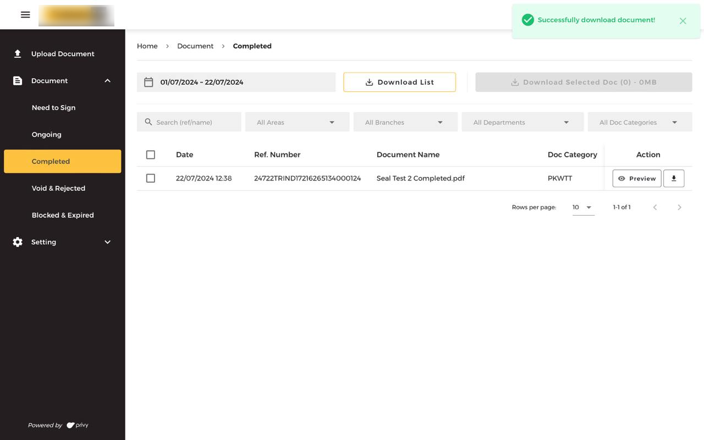
    </a>
    <figcaption style="text-align:center"><small>Capture 2. Document Completed</small></figcaption>
</figure>

<figure style="width:100%">
    <a href="images/privy_dcc_document_completed_preview.png"
    target="_blank"
    rel="noopener noreferrer">
        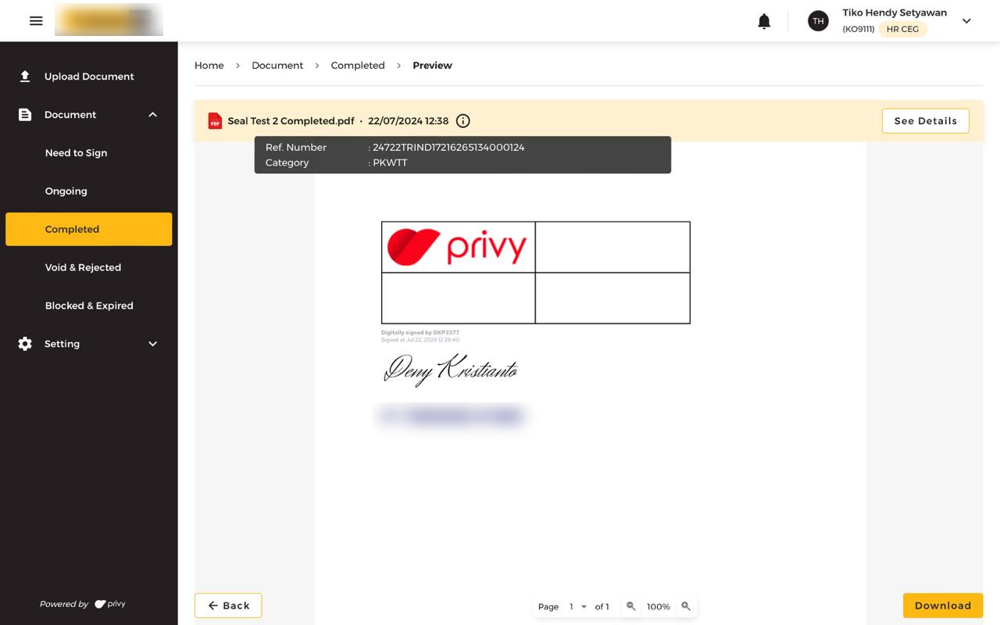
    </a>
    <figcaption style="text-align:center"><small>Capture 3. Document Completed Preview</small></figcaption>
</figure>

<figure style="width:100%">
    <a href="images/privy_dcc_document_void_reject.png"
    target="_blank"
    rel="noopener noreferrer">
        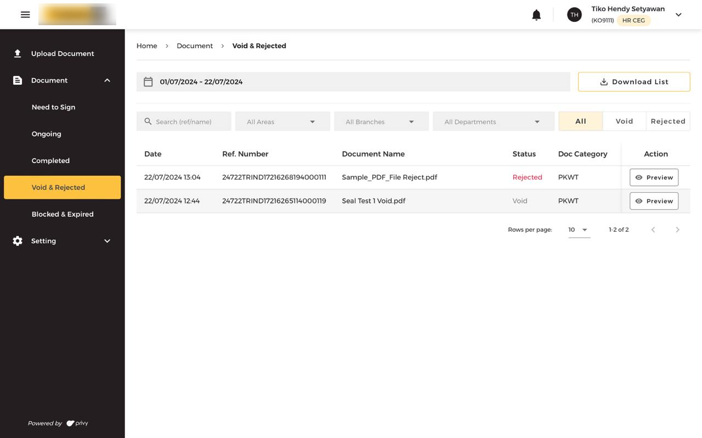
    </a>
    <figcaption style="text-align:center"><small>Capture 4. Document Void & Reject</small></figcaption>
</figure>

  

    <figure style="width:100%">
        
        <figcaption style="text-align:center"><small>Capture 5. Balance Transfer</small></figcaption>
    </figure>
  

  

    <figure style="width:100%">
        
        <figcaption style="text-align:center"><small>Capture 6. Balance Top-Up</small></figcaption>
    </figure>
  

<figure style="width:100%">
    
    <figcaption style="text-align:center"><small>Capture 7. User Setting</small></figcaption>
</figure>

<figure style="width:100%">
    <a href="images/privy_dcc_http_logs.png"
    target="_blank"
    rel="noopener noreferrer">
        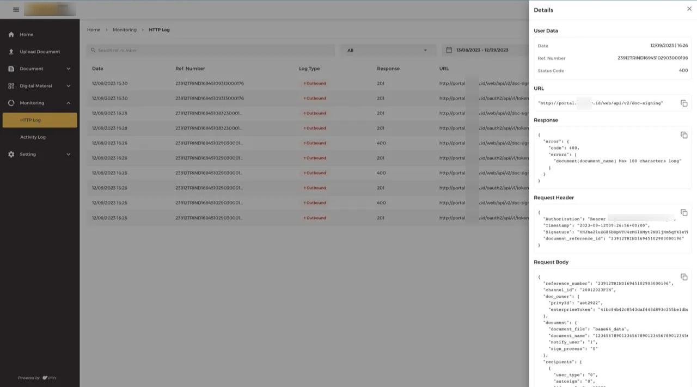
    </a>
    <figcaption style="text-align:center"><small>Capture 8. HTTP Logs</small></figcaption>
</figure>

____

# Widya Analytic: Documentation Platform

<b>Role:</b> Technical Writer 
<b>Duration:</b> 2 months

The Widya Analytic Documentation platform, serves as a centralized and structured knowledge base for all product and engineering documentations. It consolidates critical information such as <b>High-Level Architecture (HLA)</b> diagrams, <b>API specifications</b>, and <b>service sequence diagrams</b>, ensuring alignment between engineering and product teams. This platform was designed to support clarity and accessibility as Widya Analytic's systems evolved.

<b>Tech Stack:</b> Markdown, Sphinx

### Contributions

- <b>Developed and maintained</b> a comprehensive documentation portal with [Sphinx](https://www.sphinx-doc.org/), covering all major system components and development workflows.
- <b>Standardized documentation structure</b> across teams, improving consistency, readability, and ease of navigation.
- <b>Documented High-Level Architectures (HLA), APIs, and service interactions</b>, enabling faster understanding and onboarding for internal stakeholders.
- <b>Improved developer experience</b> by ensuring all technical references were up-to-date, version-controlled, and easily accessible.
- <b>Enhanced visual communication</b> through integrated diagrams that clearly illustrated system flows and dependencies.

### Capabilities Demonstrated

- Proficient in <b>building centralized documentation platforms</b>, consolidating system architecture, API references, and service diagrams to support cross-team alignment.
- Skilled in <b>visualizing and documenting</b> architecture and technical flows, making complex systems more accessible to developers and product teams.
- Experienced in defining and maintaining <b>standardized documentation practices</b>, improving clarity, reducing onboarding time, and ensuring up-to-date technical references.

### Documentation

<figure style="width:100%">
    
    <figcaption style="text-align:center"><small>Capture 1. Documentation - ETL Architecture</small></figcaption>
</figure>

  

    <figure style="width:100%">
        
        <figcaption style="text-align:center"><small>Capture 2. Documentation - Dashboard</small></figcaption>
    </figure>
  

  

    <figure style="width:100%">
        
        <figcaption style="text-align:center"><small>Capture 3. Documentation - Connect Facebook</small></figcaption>
    </figure>
  

<figure style="width:100%">
    
    <figcaption style="text-align:center"><small>Capture 4. Documentation - Endpoint</small></figcaption>
</figure>

____

# Widya Analytic: Store Platform

<b>Role:</b> Full-Stack Engineer 
<b>Duration:</b> 8 months

A comprehensive web platform that hosts the <b>Widya Analytic product store</b>, blog access— integrated with WordPress CMS, and event registration. The platform supports seamless purchases transactions, and Single Sign-On (SSO) for user authentication across all Widya Analytic products.

<b>Tech Stack</b>

- <b>Frontend:</b> Vue.js
- <b>Backend:</b> Django REST Framework
- <b>Databases:</b> PostgreSQL, MongoDB
- <b>Third-Party Integrations:</b> Midtrans (Online Payment Gateway)

### Contributions

- Developed a <b>product store API</b> with integrated <b>online payment</b> using <https://midtrans.com/id>, enabling seamless transactions for digital products.
- Built an <b>SSO (Single Sign-On) authentication system</b> to unify user sessions across all Widya Analytic platforms, improving user experience and access control.
- Implemented an <b>Event Management API</b> using <b>MongoDB</b> to handle dynamic, unstructured event-related data with high flexibility.
- Contributed an <b>internal ReactJS dashboard</b> (another platform) for monitoring and managing all product payment transactions, providing key insights and operational oversight.

### Capabilities Demonstrated

- Full-stack development across <b>multiple frameworks and technologies</b> (Vue, React, Django, PostgreSQL, MongoDB).
- Experience integrating secure <b>third-party payment systems</b>.
- Designed cross-platform <b>SSO architecture</b>e to centralize authentication flows.

### Architecture

<figure style="width:100%">
    
    <figcaption style="text-align:center"><small>Figure 1. Widya Analytic Store - Architecture</small></figcaption>
</figure>

### Documentation

<figure style="width:100%">
    <a href="images/2021_widya_analytic_store_banner.png"
    target="_blank"
    rel="noopener noreferrer">
        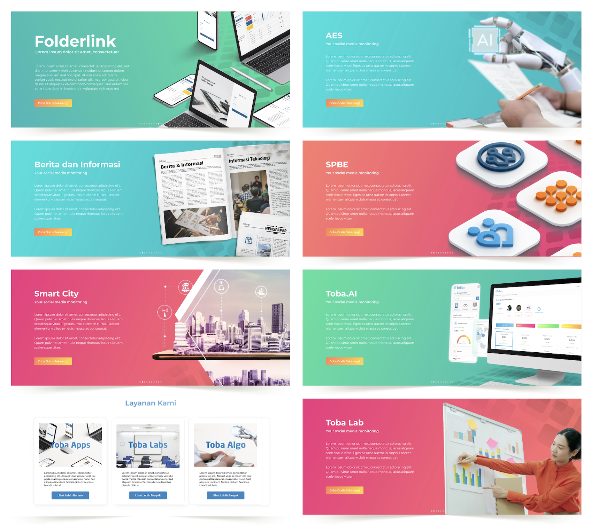
    </a>
    <figcaption style="text-align:center"><small>Capture 1. Widya Analytic Store - Banner</small></figcaption>
</figure>

____

# Widya Analytic: Toba.AI

<b>Role:</b> Full-Stack Engineer 
<b>Duration:</b> 2 years

Toba.AI is Widya Analytic’s flagship product that leverages artificial intelligence for <b>social media benchmarking</b>, <b>trend recognition</b>, and <b>text sentiment analysis</b>. The system implements a robust ETL pipeline using Apache Airflow to crawl data from external sources, load data into a centralized data lake, and transform it into structured formats for downstream analysis.

<b>Tech Stack</b>

- <b>Frontend:</b> Vue.js
- <b>Backend:</b> Django REST Framework
- <b>Databases:</b> PostgreSQL

### Contributions

- <b>Insight API Development:</b> Engineered backend APIs to deliver analytical insights from Instagram account data, powering visualizations and metrics across the <b>"Audiens," "Kompetitor,"</b> and <b>"Performa"</b> dashboard.
- <b>Analytical Data Aggregation:</b> Built complex query logic to perform multi-dimensional aggregation, including time-series breakdowns, sentiment tracking, and statistical number.
- <b>Scalable Data Architecture:</b> Ensured high-performance delivery of insights by optimizing query structures and schema designs within PostgreSQL to handle large-scale analytical workloads.

### Capabilities Demonstrated

- Skilled in designing and developing <b>RESTful APIs that serve complex analytical data</b>, enabling insight-driven user experiences through visual dashboards and metrics.
- Experienced in crafting <b>complex SQL queries</b> to perform multi-dimensional data aggregation (data cube).

### Architecture

<figure style="width:100%">
    
    <figcaption style="text-align:center"><small>Figure 1. Widya Analytic Toba.AI - Architecture</small></figcaption>
</figure>

### Documentation

<figure style="width:100%">
    <a href="images/widya_toba_ai_v0.png"
    target="_blank"
    rel="noopener noreferrer">
        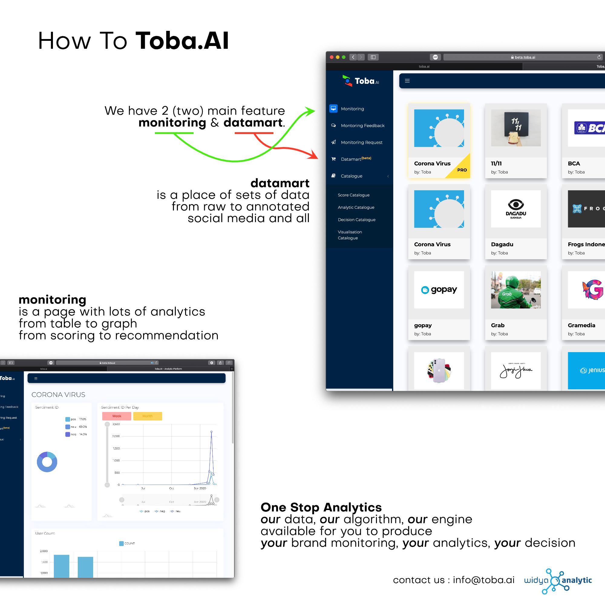
    </a>
    <figcaption style="text-align:center"><small>Capture 1. Toba.AI V0</small></figcaption>
</figure>

  

    <figure style="width:100%">
        
        <figcaption style="text-align:center"><small>Capture 2. Toba.AI V1 - Brand List</small></figcaption>
    </figure>
  

  

    <figure style="width:100%">
        <a href="images/widya_toba_ai_v1_brand_detail.png"
        target="_blank"
        rel="noopener noreferrer">
            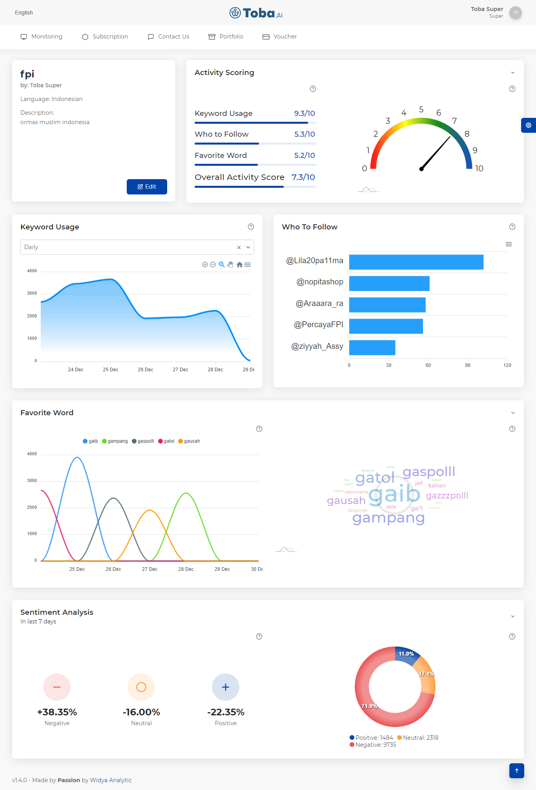
        </a>
        <figcaption style="text-align:center"><small>Capture 3. Toba.AI V1 - Brand Detail</small></figcaption>
    </figure>
  

  

    <figure style="width:100%">
        <a href="images/widya_toba_ai_v2_audiens.png"
        target="_blank"
        rel="noopener noreferrer">
            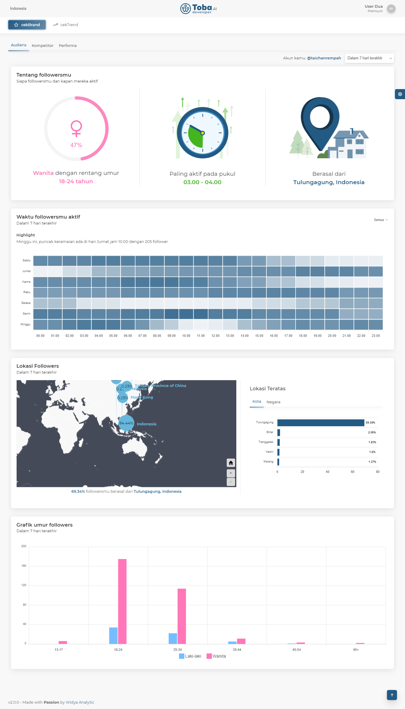
        </a>
        <figcaption style="text-align:center"><small>Capture 4. Toba.AI V2 - Audiens</small></figcaption>
    </figure>
  

  

    <figure style="width:100%">
        
        <figcaption style="text-align:center"><small>Capture 5. Toba.AI V2 - Kompetitor</small></figcaption>
    </figure>
  

  

    <figure style="width:100%">
        
        <figcaption style="text-align:center"><small>Capture 6. Toba.AI V2 - Performa</small></figcaption>
    </figure>
  

[Back](./)
